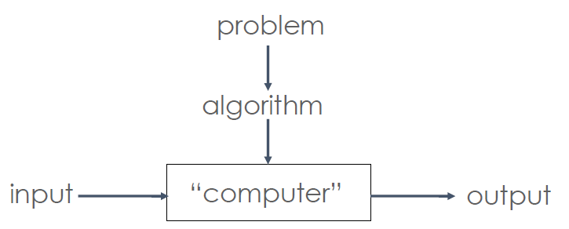
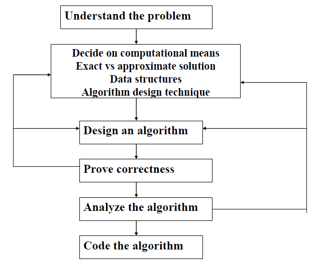
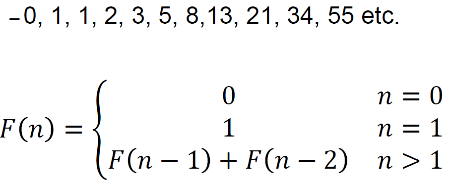

# Introduction
# What is an algorithm?
* A sequence of unambiguous instructions for solving a well-defined problem. Algorithms are guaranteed to terminate if the input is valid.
* Algorithms are a subset of procedures, which aren't guaranteed to terminate.
# Terms
* Finite
    * Terminates after a finite number of steps
* Definite
    * Rigorously and unambiguously specified
* Inputs
    * Valid inputs are clearly specified
* Output
    * Can be proved to produce the correct output given a valid input
* Effective
    * Steps are sufficiently simple and basic
# Notion of an Algorithm


* Each step of the algorithm must be **unambiguous**
* The **range of inputs** must be specified carefully.
* The same algorithm can be represented in different ways AND Several algorithms for solving the same problem may exist - with different properties

BUT
* No point finding fastest algorithm if
    * That part of the system is not the bottleneck
    * The program will only be run a very few times (e.g.: reconciling & merging databases when 2 companies merge)
    * Time is not an issue (e.g.: can run overnight)
# Examples
## Greatest Common Divisor
* Find different methods for solving this problem
* Given two positive integers m and n, find their greatest common divisor
* E.g.: GCD(60,24) =12

I have fleshed these methods out in a [python file](examples/python/GCD.py).

**Euclid's Solution**
```java
int gcd(int m, int n){
    if(n == 0){
        return m;
    }
    return gcd(n,m%n)
}
```
So if we give this example (60,43) as inputs it will run as follows:
```
gcd(60,42)  = gcd(42,18)
            = gcd(18,6) = gcd(6,0) = 6
```

**Other Methods**

*Method 1*

1. t <- min(m,n)
2. if m % t = 0 goto 3, else goto 4
3. if n % t = 0 return t, else goto 4
4. t <- t-1
5. goto 2

gcd(60,42) tries 42,41,...


*Method 2*
```
While n != 0 do:
    r <- m mod n
    m <- n
    n <- r
return m
```


*Method 3*
1. Find prime factorization of m
2. Find prime factorization of n
3. Return product of all the common factors
```
60 = 2 * 2 * 3 * 5
42 = 2 * 3 * 7
gcd = 2 * 3 = 6
```


# Methodology of Algorithms
1. Understand the problem
2. Decide on computational means
3. Design an algorithm
4. Prove correctness
5. Analyze the algorithm
6. Code algorithm

Another representation of the above 6 steps:



# Analyzing Algorithms
* Efficiency: time and space
* Simplicity
* Generality: range of inputs, special cases
* Optimality: no other algorithm can do better
# Typical Algorithmic Problems
* Sorting and Searching
* String Processing
* Graph Problems
* Combinatorial Problems e.g.list all permutations
* Geometric Problems
    * Closest-Pair, Convex-Hull
    * GPS: Least number of roads to get from A to B?
* Numerical Problems
    * e.g.: Solving systems of equations, random numbers, matrix multiplication
# Types of Algorithms
* Brute Force
    * Try all possibilities
* Decrease & Conquer
    * Solve large instance in terms of smaller instance
* Divide & Conquer
    * Break problem into distinct subproblems
* Transform & Conquer
    * AKA Transformation
    * Covert problem to another one
* Trading Space & Time
    * Use additional data structures
* Dynamic Programming
    * Break problem into overlapping subproblems
* Greedy
    * Repeatedly do what is best now

# Fibonacci
Leonard Fibonacci, introduced the decimal system to the west in the 15th century. He also defined the fibonacci series:



Here is an extremely inefficient, brute force, example of the fibonacci algorithm 
```java
public long fibo(long n){
    if (n==0){
        return 0;
    }
    if(n==1){
        return 1;
    }
    return fibo(n-1)+fibo(n-2);
}
```
If you try this with `n=100`, it will run for a long time - this is a structure of what it will look like with a value of 6:


Better solution 1:
```
Fibo(n):
    F[0] = 0
    F[1] = 1
    for i = 2 to n do:
        F[i] = F[i-1]+F[i-2]
    return F[n]
```

Here is an even better solution:
```java
public BigInteger fibo(int n){
    if(n==0){
        return 0;
    }
    if(n==1){
        return 1;
    }
    BigInteger[] table = new BigInteger[3];
    table[0] = new BigInteger("0");
    table[1] = new BigInteger("1");
    for(int i = 2; i < n; i++){
        table[2] = table[1].add(table[0]);
        table[0] = table[1];
        table[1] = table[2];
    }
    return table[2];
}
```

Using a formula
```java
public long fibo(in n){
    return Math.round(1.0/Math.sqrt(5.0)*Math.pow(1.6180339887,n));
}
```
While it may look extremely efficient it wil be incorrect from a value of 43 onwards as Fibo(43) wil give 433494436 and the correct answer 433494437.
Using Java it calculates Fibo up to 43 correctly. But for Fibo(43) and onwards it gets increasingly worse. This is due to floating point precision. 

# Puzzle
**Problem**:

4 people must cross a bridge in 17 minutes. All start the same side. Max 2 on bridge at a time. To cross must carry a torch; there is only 1 torch

**constraints**

People A,B, C & D walk at different speeds:
* A = 1 minute to cross
* B = 2 minutes
* C = 5 minutes
* D = 10 minutes
A pair walks at the speed of the slower person

**Solution**

In order to meet the requirements of the puzzle, you have think about the trip in terms of the total time.
If you send A and B across, it takes 2 minutes. You then send A back which will add another minute. At this point A C and D are on the one side of the bridge and I would have sent D with A back, which is incorrect. In terms of the total time it would take to get D across the bridge, it is greater than C. Thus, you should send D and C across the bridge together which will take 10 minutes. Then you can use C to fetch A which will take another 4 minutes. This will look as follows:

|Action | Bridge Beginning | Bridge End| Time Taken | Total Time|
|---|---|---|---|---|
|Start|ABCD||0|0|
|AB Cross|CD|AB|2|2|
|A Back|B|ACD|1|3|
|CD Cross|A|BCD|10|13|
|B Back|AB|CD|2|15|
|AB Cross||ABCD|2|17|

**Extension**

This is an instance of a problem. How would we go about generalising it?

* Must output the minimum time required for a crossing
* Are there any special cases to watch out for?
* Are there any constraints on the input?

**Solution**
* Input: a list of crossing times for n people, numbered 1,..., n
* Output: total time to cross
* Strategy: use 1 & 2 as shuttles and send the others across in pairs:
```
for i <- 2 to n/2 do:
    t <- a[2]
    t <- t+a[1]
    t <- t+a[i*2]
    t <- t+a[2]
t <- t + a[2]
return t
```
In this solution, 1 and 2 cross then 1 goes back then 2 and 3 go across and 2 back. Then 1 & 2 go across. It then returns the time taken

This solution is inadequate that falsely assumes certain inputs:
* list may not be sorted n ascending order
    * Sort 
* n may not be even numbered
    * Add an extra clause after the loop
* n > 3 not guaranteed 
    * special case for n = 1,2,3
* Is not optimal for all inputs e.g.: {1,20,21,22}
    * Can you quantify the nature of these inputs? Suggest an alternative

