# Theory of Algorithms <!--omit in toc -->
- [Theory of Algorithms ](#theory-of-algorithms)
- [Algorithm Efficiency](#algorithm-efficiency)
    - [Typical Algorithm Efficiency Classes](#typical-algorithm-efficiency-classes)
- [Big O - Intuitively](#big-o---intuitively)
- [Definition Big O](#definition-big-o)
- [Omega Ω (Not important)](#omega-%CF%89-not-important)
- [Theta Θ (Important)](#theta-%CE%B8-important)
- [Formal Definitions - Summary](#formal-definitions---summary)
- [O vs Θ](#o-vs-%CE%B8)
- [Test Your Understanding](#test-your-understanding)
- [Asymptotic Complexity classes](#asymptotic-complexity-classes)
- [Calculating Algorithm Efficiency](#calculating-algorithm-efficiency)
- [Maths](#maths)
- [Set Example](#set-example)
    - [Brute Force Solution](#brute-force-solution)
    - [Decrease & Conquer](#decrease--conquer)
    - [Transform & Conquer](#transform--conquer)
- [Analysing Recursive Factorial](#analysing-recursive-factorial)
    - [Backwards Substitution:](#backwards-substitution)
- [Recurrence Relations](#recurrence-relations)
# Algorithm Efficiency
* We need measures of:
    * Input size (call this n)
    * Unit of measuring time
        * The basic operation of the algorithm
* We're usually interested in growth order:
    * O(n<sup>2</sup>) vs O(n<sup>3</sup>) is more important than 1412n<sup>2</sup> vs 5n<sup>3</sup>
* We're interested in growth order
    * So O(n<sup>2</sup>) vs O(n<sup>3</sup>) is more important than *1412*n<sup>2</sup> vs *5*<sup>3</sup>
* We are measuring the operational complexity
* Interested in the
    * Worst case
    * Average case
    * Best case

**Example: Linear Search**

What are the cases?
* Worst = n
    * Looks at all n elements in the array
* Average = n/2
    * On average it will look at n/2 elements before finding the element being searched
    * Therefore n/2. but the 1/2 is a constant, so it is simply left as n
* Best = constant time, or O(1) - as it nly looks at one element

Generally most interested in worst case. If the best case is good enough, we are interested in that

## Typical Algorithm Efficiency Classes

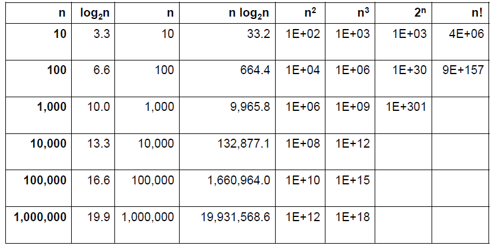

# Big O - Intuitively
* Algorithm Executes
    * `2n+10` operations
    * We are not interested in the 2 or the 10. 
    * This is simply O(n)
* Algorithm Executes:
    * 3n<sup>2</sup> + 9n + 5
    * Not interested in the 3, 9n or 5. 
    * This is O(n<sup>2</sup>)

**Example**
* Laptop sorts array of 100 million items in 30 seconds using:
    * n*logn = 2 657 542 476 -> 30 seconds
    * n = 10 000 000 000 000 000 = 10<sup>16</sup> 
    * 10<sup>16</sup> / 2 657 542 476 = 3762875
    * 3762875 x 30 seconds = 112 886 248s
    * 3.5 years
* Insertion sort and Bubblesort are impractical for large data sets

# Definition Big O
A function *t(n) ∈ of O(g(n))*

If there is a c and an n<sub>0</sub> such that t(n) <= cg(n) for all n>=n<sub>0</sub>.
* Example 1: 100n+5 ∈ of O(n)
    * Set c to 101 and n<sub>0</sub> to 6. Then prove that 100n+5 <=101n for all n >=6 Simple to prove with induction
* Example 2: 100n+5 ∈ O(n<sup>2</sup>)
    * Set c = 21 and n<sub>0</sub> = 5. So prove that 100n+5<=21n<sup>2</sup>

**Example**

100n+5 element O(n)
set say c to 101 and n<sub>0</sub> to 6
Prove 100n+5 <= 100n for all n>=6 by induction

# Omega Ω (Not important)
* A function t(n) ∈ Ω(g(n)) if there is a c and an n<sub>0</sub> such that t(n) >= cg(n) for all n >= n<sub>0</sub>
* Same as Big O, except **bigger than** instead of **smaller than** sign


# Theta Θ (Important)
* Consider sequentially summing an array
    * If the efficiency class is O(n)
    * But it is also by our definition O(n<sup>2</sup>) and O(2<sup>n</sup>) and O(nlogn)
    * It is NOT O(logn)
* Big O(n<sup>2</sup>) means the algorithm's basic operations executes in proportion to n<sup>2</sup> or better
* How do we say that summing array's basic operation executes **exactly** proportional to n?
    * Theta Θ
* Efficiency class for summing an array is Θ(n). It is not:
    * Θ(n<sup>2</sup>) or Θ(nlogn).
    * It is precisely Θ(n)

* A function  t(n) ∈ Ω(g(n)) if there is a c<sub>1</sub>, c<sub>2</sub> and n<sub>0</sub> such that c<sub>2</sub>g(n) <= t(n) <= c<sub>1</sub>g(n) for all n>=n<sub>0</sub>
* Same as big O except functions in this class cannot be in a more efficient class
    * We use this a lot:
        * 100n+5 ∈ Θ(n)
        * 100n+5 ∈ O(n<sup>2</sup>)
        * But 100n + 5 is NOT ∈ Θ(n<sup>2</sup>)

* If an algorithm is in Θ(g(n)):
    * It means that the running time of the algorithm as n (input size) gets larger is proportional to g(n)
* If an algorithm is in O(g(n))
    * It means that the running time of the algorithm as n gets larger is at most proportional to g(n)

> Big Oh is NO worse

> Big Omega is oh my god

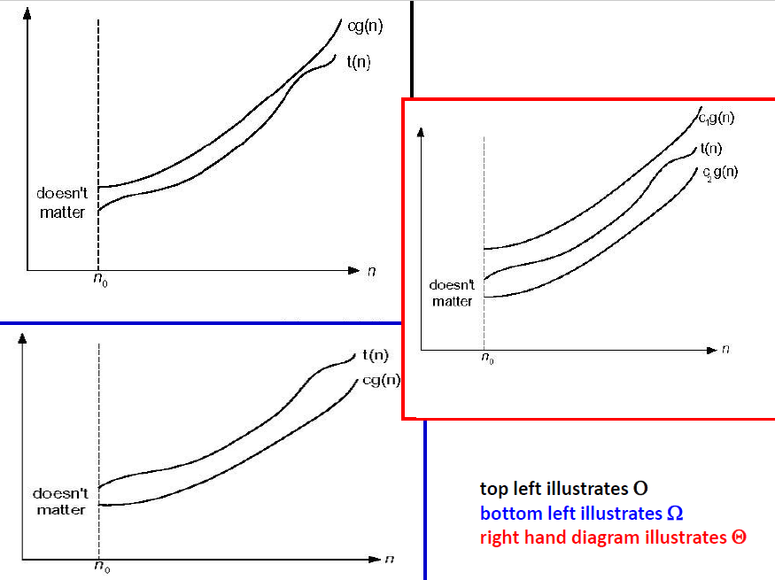

[Check this out](https://medium.com/@.RT/total-n00bs-guide-to-big-o-big-%CF%89-big-%CE%B8-aa259ae8a1c2)

# Formal Definitions - Summary
* Definition: *f(n) ∈ O(g(n))* iff there exists positive constant c and non-negative integer n<sub>0</sub> such that 
    ** f(n) <= c g(n)* for every n >=n<sub>0</sub>
* Definition: *f(n) ∈ Ω(g(n))* iff there exist positive constant c and non-negative integer n<sub>0</sub> such that
    * *f(n) >= c g(n)* for every n >= n<sub>0</sub>
* Definition: *f(n) ∈ Θ(g(n))* iff there exist positive constants c<sub>1</sub> and c<sub>2</sub> and non-negative integer n<sub>0</sub> and non-negative integer n<sub>0</sub> such that 
    * *c<sub>1</sub> g(n) <= f(n) <= c<sub>2</sub> g(n)* for every n >= n<sub>0</sub>

* O(g(n)): functions that grow no faster than g(n)
* Ω(g(n)): functions that grow at least as fast as g(n)
* Θ(g(n)): functions that grow at same rate as g(n)

* O(g(n)): functions no worse than g(n)
* Ω(g(n)): functions at least as bad as g(n)
* Θ(g(n)): functions as efficient as g(n)

# O vs Θ
* O is an upper bound on performance
* Θ is a tight bound
    * It is the upper and lower bound

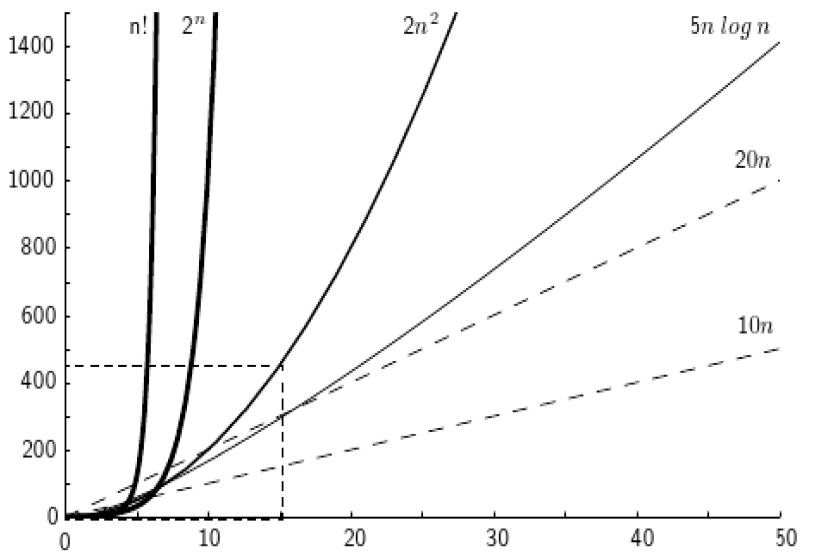

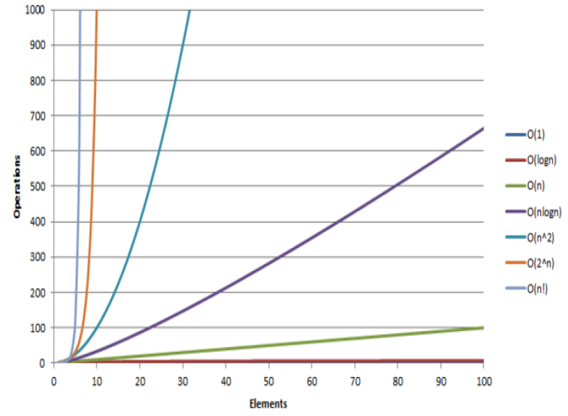

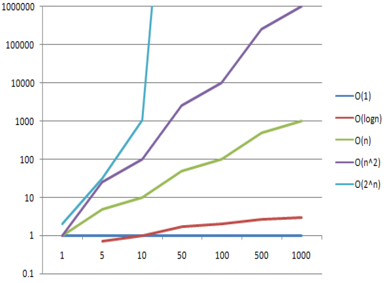

**Examples**
* Average of O(n<sup>2</sup>) -> algorithms grows at most as fast as n<sup>2</sup> with average case input
    * E.g.: Bubble sort
* Worst case of O(n<sup>3</sup>) -> algorithm grows at most as fast as n<sup>3</sup> with its worst case
    * E.g.: brute force matrix multiplication, which is also Θ(n<sup>3</sup>)
* Best case of Θ(n) -> algorithm grows linearly in the best case
    * E.g.: sum an array
* Worst case of Ω(2<sup>n</sup>) -> algorithm grows at best exponentially in worst case
    * E.g.: Create the power set
* With practice it often becomes easy for many algorithms

# Test Your Understanding
In this section there are 8 question answer s.


**1. True or false: Θ (n + log n) = Θ (n)?**

<details>
<summary>View answer</summary>
True. We can discard addition terms that are less significant.

**Proof:**
```
Θ(2n) = Θ(n)
    n+log n < n + n
    n + log n < 2n
    Θ (n + logn) not a worse efficiency class

Θ (n + logn) not a better efficiency class
So must be the same efficiency class
```
</details>

**2. True or false: O (n + log n) = O (n)**
<details>
<summary>View answer</summary>
True. We can discard addition terms that are less significant.
</details>

**3. True or false: Θ (n log<sub>2</sub> n) = Θ (n log<sub>10</sub>n)**
<details>
<summary>View answer</summary>
True. log<sub>2</sub> n / log<sub>10</sub>n = a constant = 3.32 approximately

</details>

**True or false: Θ (log<sup>2</sup>n) = Θ (log n)**
<details>
<summary>View answer</summary>
False. Θ (log<sup>2</sup>n) grows more than a constant faster than Θ (log n)

</details>

**True or false: O (n log n) = O (n)**
<details>
<summary>View answer</summary>
False. These are two different sets. But O (n) is a subset of O (n log n).

</details>

**True or false: if x ∈ O (n log n) then x ∈ O (n<sup>2</sup>)**
<details>
<summary>View answer</summary>
True. E.g. Mergesort efficiency is in O (n log n). By definition it is also therefore in O(n<sup>2</sup>)
</details>

**True or false: if x ∈ Θ (n log n) then x ∈ Θ (n<sup>2</sup>)**
<details>
<summary>View answer</summary>
False. E.g. Mergesort is strictly Θ(n log n)
</details>

**True or false: if x ∈ O (n log n) then x ∈ O (n)**
<details>
<summary>View answer</summary>
False. x might be ∈ O(n) but it might not be. E.g. Mergesort
</details>

# Asymptotic Complexity classes
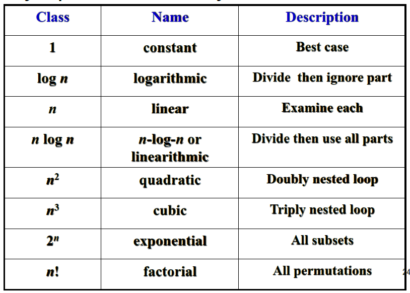

# Calculating Algorithm Efficiency
* Identify its basic operations
    * Operations that are executed repeatedly at the core of the algorithm
    * E.g.: comparisons and swapping in sorting
    * Multiplications and additions in matrix multiplication
* Set up an equation which counts the number of basic operations for a given input of size n

**Example**
```
int MysteryFunction(A[0.. n -1])
    MysteryVal = A[0]
    For i = 1 to n - 1:
        If A[i] > MysteryVal:
            MysteryVal = A[i]
    Return MysteryVal
```
**What does this algorithm do?**
<details>
<summary>View Answer</summary>
It gets the maximum value
</details>

This example's basic operation is to check the value at a position in the array vs the current maximum value (MysteryVal) and return the maximum value in the array. Or:
`A[i] > MaxVal`

Let `c(n) = number of times it has executed`

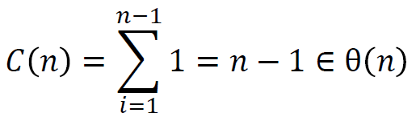

# Maths
Page 88-89 in the textbook TODO, which textbook

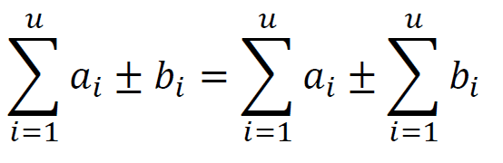

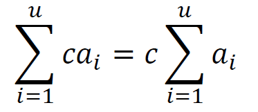

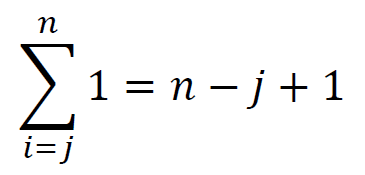

This means that if you add 1 *n* times, you will simply get n

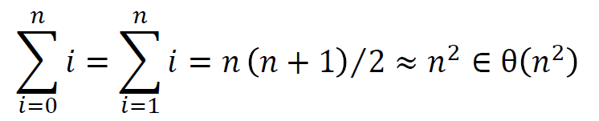

This means that `1+2+3+4+5+...+n-1+n` = `n(n+1)/2`

# Set Example
Think up algorithms to determine if there are duplicate values in array A. Find out if it is a set, the time complexities of the solution and the most efficient solution.

## Brute Force Solution
```java
boolean isSet(A){
    for (i = 0; i < A.length - 1;i++){
        for(j = i+1; j < A.length;j++){
            if(A[i]==A[j]){
                return false;
            }
        }
    }
    return true;
}
```
The above solution can be broken down into the following format `(n-1 + n-2 + n-3 + ... + 1) = n(n-1)/2`. This is because the inner loop is executed n-1 times, and the outer loop is executed n times.

Therefore, the worst case is Θ(n<sup>2</sup>), and the average case is that too.

TODO Add section here

## Decrease & Conquer
```java
boolean isSet(Array A, int index = 0){
    if(index >= A.length-1){
        return true;
    }

    for(i = index+1; i < A.length;i++){
        if(A[index]==A[i]){
            return false;
        }
    }
    return isSet(A,index+1);
}
```
This algorithm is identical to the brute force one. Same complexities as above.

## Transform & Conquer
```java
boolean isSet(A){
    sort(A);
    for(int i = 0; i < A.length-1;i++){
        if(A[i]==A[i+1]){
            return false;
        }
    }
    return true;
}
```
The most efficient sorting algorithms have a complexity of Θ(nlogn). The for loop is linear for the worst case: Θ(n)

It runs the sort, then the for loop so this is Θ(nlogn+n), the worst case order of an algorithm is the efficiency of its worst part. So the algorithm is Θ(nlogn) which is faster than the brute force solution of Θ(n<sup>2</sup>).

The transform and conquer method of sorting then searching to test for a set is faster than the brute force method.

# Analysing Recursive Factorial
```python
int F(n){
    if n == 0:
        return 1;
    return F(n-1)*n;
}
```
* We want to count the multiplication. 
* Multiplies once for every recursive call
```
M(0)=0
And M(n)=M(n-1)+1
M(n) = M(n-1) + 1 = [M(n-2) + 1]+1
= [M(n-3 + 1) + 2]= M(n-3)+3

Thus, in general:
M(n) = M(n-k)+k
M(n) = M(n-n) + n = M(0) + n = n
```

## Backwards Substitution:
1. Express x(n-1) successively as a function of x(n-2), x(n-3)
2. Derive x(n-j) as a function of j
3. Substitute n-j = base condition

The above equation can be solved by backward substitution:
```
M(n) = M(n-1)+1
Substitute M(n-1) = M(n-2) + 1
-> M(n) = [M(n-2) + 1]+1 = M(n-2) + 2
Substitute M(n-2) = M(n-3) + 1
    M(n) = [M(n-3) + 1] + 2 = M(n-3) + 3
-> Pattern: M(n) = M(n-j) + j
Ultimately: M(n) = M(n-n)+n = M(0) + n = n
```

# Recurrence Relations
* Recurrence relation is a recursive mathematical function e.g.:
```
M(n) = M(n-1)+1
```
* We will consider these recurrence relations
```
T(n) = aT(n-k) + f(n)
OR
T(n) = aT(n/b) + f(n)
```