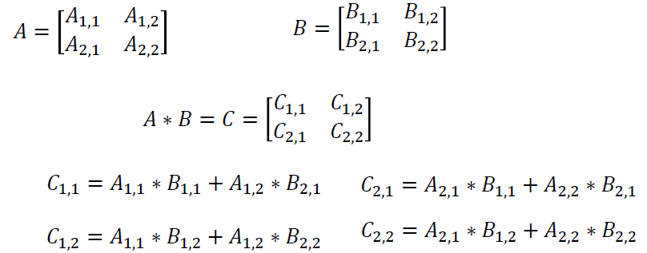
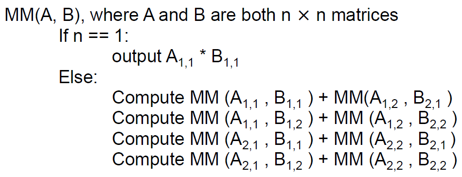
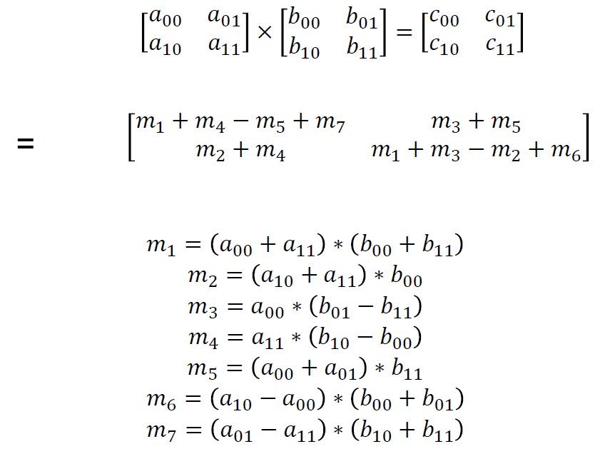
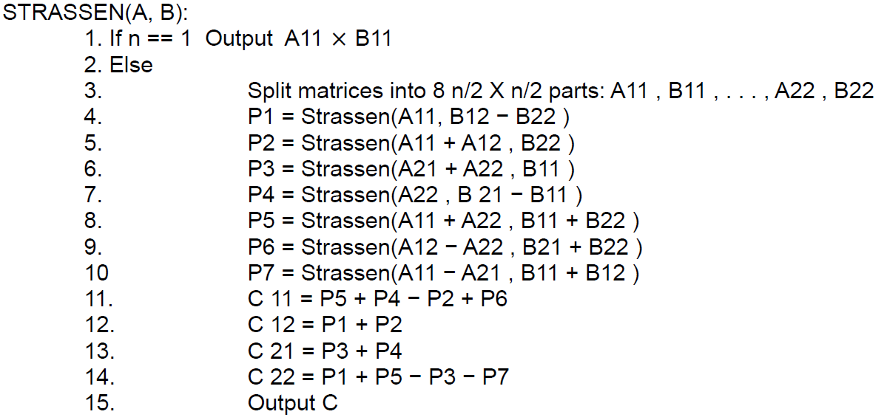
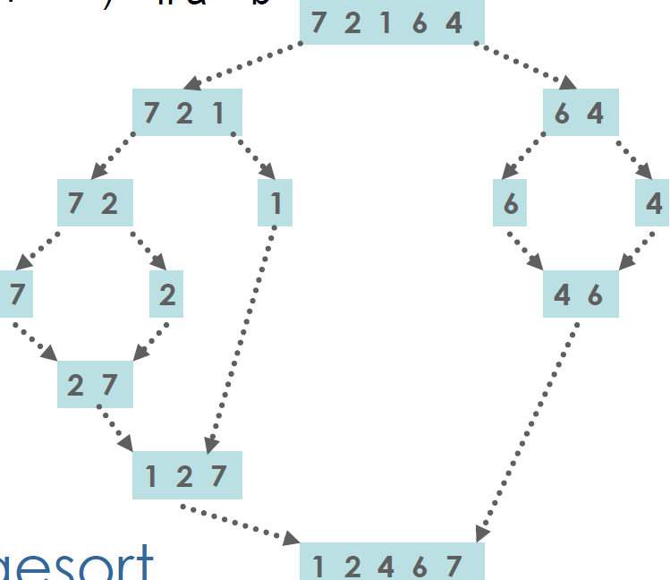
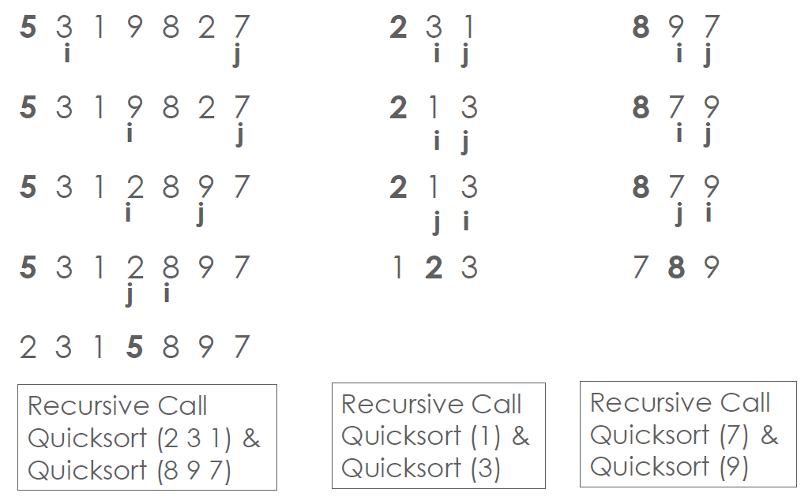
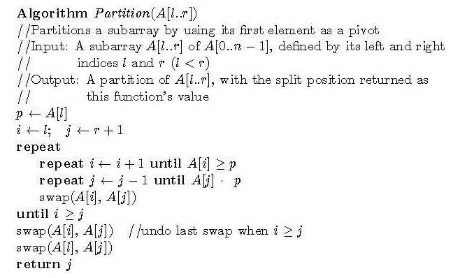
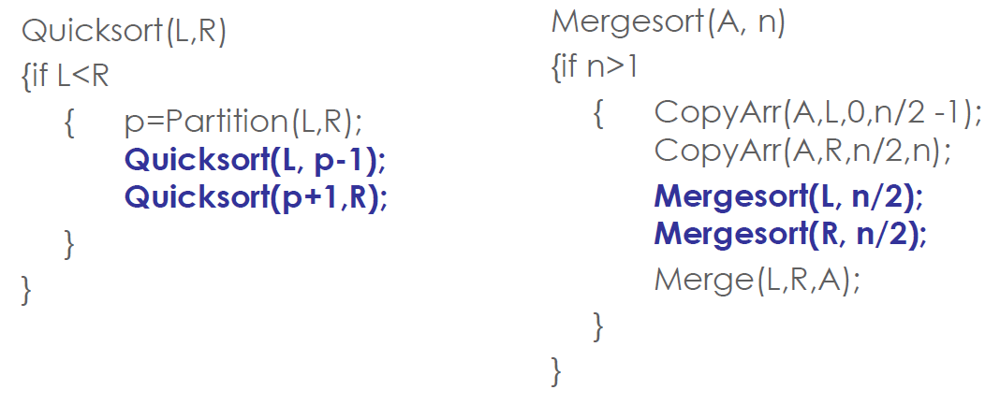
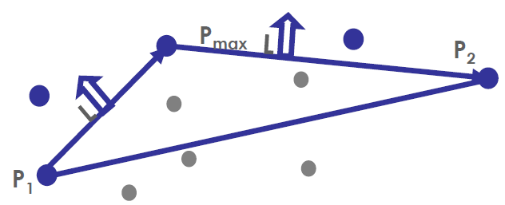
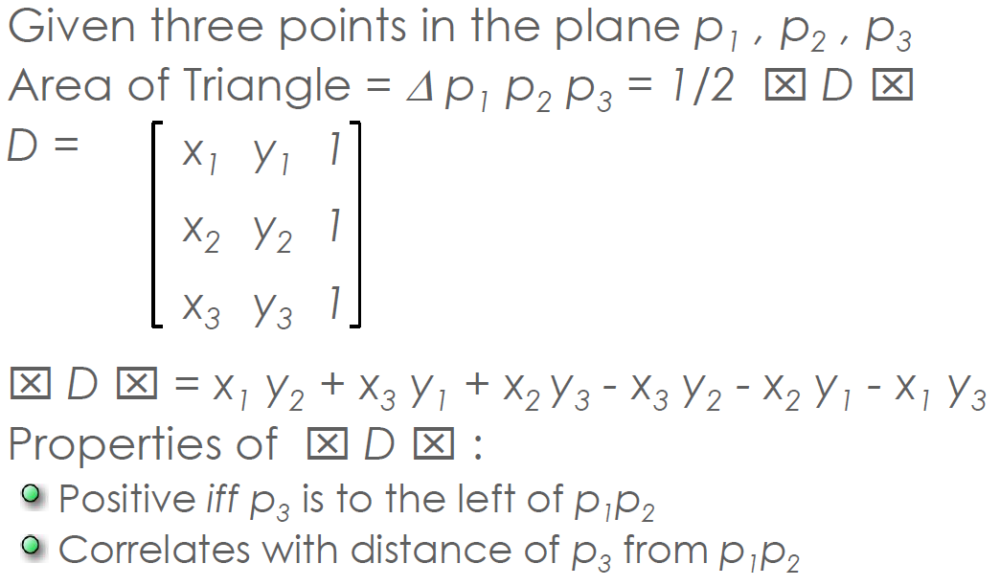

- [Master Theorem](#master-theorem)
    - [Example](#example)
- [Divide & Conquer](#divide--conquer)
    - [Matrix Addition](#matrix-addition)
    - [Matrix Multiplication](#matrix-multiplication)
        - [Brute Force](#brute-force)
        - [Divide & Conquer](#divide--conquer)
        - [Strassen's Method](#strassens-method)
    - [Mergesort](#mergesort)
    - [Quicksort](#quicksort)
    - [Quicksort & Mergesort](#quicksort--mergesort)
    - [Closest Pair](#closest-pair)
    - [Convex Hull Problem](#convex-hull-problem)

# Master Theorem
If we have a recurrence of this form:

T(n) = aT(n/b) + f(n) and f(n) ∈ Θ (n<sup>2</sup>) then:
* T(n) ∈ Θ(n<sup>d</sup>) if a < b<sup>d</sup>
* T(n) ∈ Θ(n<sup>d</sup>logn) if a = b<sup>d</sup>
* T(n) ∈ Θ(n<sup>log<sub>b</sub>a</sup>) if a > b<sup>d</sup>

Analogous results for O and Ω
* For this course we have to know how to apply the Master Theorem, not prove it or derive it

## Example
```python
int CountBits(int n):
    if(n==1):
        return 1
    else:
        return 1 + CountBits(n/2)
```
Recall that this is how we found the algorithmic efficiency before hand: 
* A(1) = 0 (Addition doesn't take place when n == 1)
* A(n) = A(n/2) + 1 for n > 1
* by letting n = 2<sup>2</sup> which is the same as saying k = log<sub>2</sub>n
* n/2 = 1/2 * 2<sup>2</sup> = 2<sup>-1</sup>*2<sup>k</sup> = 2<sup>2-1</sup>
* A(1) = A(2<sup>0</sup>) = 0
* A(n) = A(2<sup>2</sup>) = A(2<sup>k-1</sup>) + 1 for k > 0
* = [A(2<sup>k-2</sup>) + 1] + 1 = A(2<sup>k-2</sup>) + 2
* = A(2<sup>k-k</sup>)+k = A(2<sup>0</sup>) + k = k = log<sub>2</sub>n ∈ Θ (logn)

But with the master theorem we can see that 
* a = 1
* b = 2
* d = 0

Because if we put CountBits in the form of the master theorem i.e.: T(n) = aT(n/b) + f(n) it will look as follows:

* A(n) = A(n/2) + 1

Thus the values for a, b and d are as outlined above and by subbing them into the equation: a = b<sup>d</sup> then, with the master theorem we get the following:
* 1 = 2<sup>0</sup> 
* Which is equal

And if we look at the master theorem cases again:
* T(n) ∈ Θ(n<sup>d</sup>) if a < b<sup>d</sup>
* T(n) ∈ Θ(n<sup>d</sup>logn) if <u><b>a = b<sup>d</sup></b></u>
* T(n) ∈ Θ(n<sup>log<sub>b</sub>a</sup>) if a > b<sup>d</sup>

According to the second case, the recursive function will have the efficiency of T(n) ∈ Θ(n<sup>d</sup>logn). Thus, CountBits has the algorithmic efficiency of Θ (n<sup>0</sup>logn) i.e.: CountBits is **Θ (logn)**

But what do `a`, `b` and `d` mean?
* a is the number of recursive calls
* b is the fraction of the input the recursive call works on
* d is the other work done

# Divide & Conquer
* Divide & Conquer is the best known algorithm design strategy:
    1. Divide instances of problem into two or more smaller instances
    2. Solve smaller instances recursively
    3. Obtain solution to original (larger) instance by combining these solutions

Here is an example of finding a recursive solution:
* What would you do if you had the smallest (non-trivial) number of input values? (say n)
* If you did the above for 2 separate inputs of that size, could you use those 2 results to give you the solution to the problem for all 2n input values?
* Try it by hand and see. Maybe for n, then 2n, and then 4n. It it works for those it will (probably) work for any n
* Code and test with input size n, then 2n, then 4n


## Matrix Addition


Which we can represent algorithmically as:
```java
for(int row = 0; row<n; row++){
    for(int col = 0; col < n; col++){
        C[row][col] = A[row][col] + B[row][col]
    }
}
```
Add matrix A to matrix B to get matrix C - Θ(n<sup>2</sup>)
## Matrix Multiplication
### Brute Force


Algorithmically:
```java
for(int row = 0; row<n; row++){
    for(int j = 0; j< n;j++){
        for(int col = 0; col < n; col++){
            C[row][col] += A[row][j] + B[j][col]
        }
    }
}
```
There are n multiplication to calculate each of the n<sup>2</sup> values - Θ(n<sup>3</sup>)

How many multiplications:


Applying the rules we learned, we get:


### Divide & Conquer
Below is a complicated recursive matrix multiplication method - only a high level understanding is needed.

So the same process as above is followed:


* Imagine that A, B & C are not 2 x 2 matrices, but n X n matrices. 
* Then the A<sub>1,1</sub>, A<sub>1,2</sub>...B<sub>i,j</sub> (i.e.: all the elements of the matrices) are n/2 x n/2 matrices. 
* With matrices, you can treat n/2 x n/2 matrices atomically
* We can recursively calculate each of the C<sub>i,j</sub> matrices
* The base can would be when n is 2, or you can make it when n is 1

There is a good walkthrough of this idea in the slides. Which you can view [here](docs/DivideAndConquerMatrixMult.pdf) - but I will simply lay out the algorithm:

The following pseudocode multiplies 2 nXn matrices. If n is not a power of 2, pad the matrices with Os to make n power of 2.



**Recurrence relation for D & C Matric Multiplication**</p>
* T(1) = 1 - one multiplication, zero additions
* For n > 1:
    * We make 8 recursive calls for multiplying n/2 x n/2 matrices
    * T(n) = 8 * T(n/2) + number of additions
        * Matrix addition is an n<sup>2</sup> operation
        * In each of the 4 compute steps we add two n/2 x n/2 matrices
        * Therefore there are 4(n/2)<sup>2</sup> additions:
            *  Θ(n<sup>2</sup>)

Thus the recurrence relation is *T(n) = 8 \* T(n/2) + Θ(n<sup>2</sup>)*

Now if we substitute those values into the masters theorem:
* a = 8
* b = 2
* d = 2
and 8 > 2<sup>2</sup>

So T(n) ∈ Θ (n<sup>log<sub>2</sub>8</sup>) and therefore:</p>
    Θ (n<sup>3</sup>)

So the Divide and Conquer method has exactly the same efficiency class as Brute Force

### Strassen's Method
* For 2x2 matrices, the standard method using the definition makes 8 multiplications and 4 additions


* But we can change this to 7 multiplications and 18 additions/subtractions using Strassen's method
* By simply reducing the number of multiplications by 1, we can increase the efficiency of matrix multiplication
* It is the multiplications that effect how many recursive calls are made
* The extra additions are just a constant factor

Here is Strassen's method for multiplying a 2x2 matrix:


To put this in an algorithm, we first have to layout some guidelines:
* A and B are n X n matrices. n is power of 2
* If n is not power of 2, pad A and B with Os
* Divide A and B into n/2 x n/2 matrices & recurse:
* By following the same structure as above, this should give us a recurrence relation of:
    * T(n) = 7 T (n/2) + Θ(n<sup>2</sup>)

The algorithm is as follows:


We can solve the relation using the Master Theorem to find out the algorithmic efficiency:
* T(n) = 7 T (n/2) + Θ(n<sup>2</sup>)
    * a = 7
    * b = 2
    * d = 2
* 7 > 2<sup>2</sup>
* A(n) ∈ Θ (n<sup>log<sub>2</sub>7)
* Which means: T(n) ∈ Θ(n<sup>2.807</sup>)
* Which is less than n<sup>3</sup>
  
* This solution was developed in 1969
* No one thought it possible to improve Θ(n<sup>3</sup>)
* Improvements continue:
    * Virginia Williams created a new algorithm in 2011 which has a complexity Θ(n<sup>2.4</sup>)
    * You can read her paper on it [here](https://people.csail.mit.edu/virgi/matrixmult-f.pdf)

## Mergesort
* Algorithm
    1. Split A[1..n] in half and put copy of each half into arrays B[1.. n/2] and C[1.. n/2]
    2. Recursively Mergesort arrays B and C
    3. Merge sorted arrays B and C into array A
* Merging
    * Repeat until no elements remain in one of B or C
    1. Compare 1st elements in the rest of B and C
    2. Copy smaller into A, incrementing index of corresponding array
    3. Once all elements in one of B or C are processed, copy the remaining unprocessed elements from the other array into A



**Efficiency**</p>
* Recurrence:
    * C(n) = 2C(n/2) + C<sub>merge</sub>(n) for n > 1, C(1) = 0
    * C<sub>merge</sub>(n) = n-1 in the worst case
* All cases have same efficiency: Θ(nlogn)
* Number of comparisons is close to theoretical minimum for comparison-based sorting:
    * logn! ≈ nlogn - 1,44n
    * pace requirement Θ(n) (NOT in-place)
    * Can be implemented without recursion (bottom-up)
## Quicksort
* Select a pivot (partitioning element)
* Rearrange the list into two sublists:
    * All elements positioned before the pivot are <= the pivot
    * Those positioned after the pivot are > the pivot
    * Requires a pivoting algorithm
* Exchange the pivot with the last element in the first sublist
    * The pivot is now in its final position
* QuickSort the two sublists



**Partitioning Algorithm**</p>



**Efficiency</p>**
* In the worst case all splits are completely skewed
* For instance, an already sorted list!
* One subarray is empty, other reduced by only one:
    * Make n+1 comparisons
    * Exchange pivot with itself
    * Quicksort left = empty, right = A[1..n-1]
    * C<sub>worst</sub> = (n+1) + n + ... + 3 = (n+1)(n+2)/2 - 3 = Θ(n<sup>2</sup>)
* While the worst case is Θ(n<sup>2</sup>), best case (split in the middle) is Θ(nlogn) and average case (random split) is Θ(nlogn)
* Improvements (in combination 20-25% faster):
    * Better pivot selection: median of three partitioning avoids worst case in sorted files
    * Switch to insertion sort on small subfiles
    * Elimination of recursion
* Considered the method of choice for sorting for large files (n >= 10 000)

## Quicksort & Mergesort



## Closest Pair
The slides have a really great walkthrough of the divide & conquer algorithm for Closest Pair, I am going to simply add the pseudo-code and efficiency [here](docs/DivideAndConquerClosestPair.pdf)

**Algorithm Overview**</p>
1. Sort points according to their x-coordinates
2. Split the set of points into two equal-sized subsets by a vertical line x = x<sub>median</sub>
3. Solve the problem recursively in the left and right subsets, so that we get the left-side and right-side minimum distances d<sub>l</sub> and d<sub>r</sub>. Therefore, d<sub>min</sub> = min(d<sub>l</sub>,d<sub>r</sub>)
4. Find the minimal distance in the set S of points of width 2d around the vertical line. Update d<sub>min</sub> if necessary

**Algorithm Pseudo-code**</p>
```
Sort points in order of x co-ordinates into array P[0 ... n-1]
Sort P in y co-ordinate order into array Q[0 ... n-1]
double ClosestPair(P,Q):
    if n <= 3: 
        return minDistance;
    copy the first ceiling [n/2] points of P to PL (L for left)
    copy the same points of Q to QL
    copy the remaining floor[n/2] points of P to PR
    copy the same points of Q to QR
    dl = ClosestPair(PL,QL)
    dr = ClosestPair(PR,QR)
    d = min(dl,dr)
    m = P[ceiling(n/2)-1].x
    copy all points of Q for which |x-m| < d into S[0 ... num - 1]
    dminsq = d * d
    for i = 0 to num -2:
        k = i + 1
        while k <= num - 1 and distance(S[K],S[i]) < dminsq
            dminsq = distance(S[K],S[i])
            k = k + 1
    return sqrt(dminsq)
```
**Algorithm Efficiency**</p>
* Pre-sorting is Θ(nlogn)
* Leaving aside the recursion every other step in the algorithm is at worst Θ(n)
* So we can set up a recurrence relation in terms of a function T of whatever basic operation you choose.
* Recursion is executed twice. So we have:
* T(n) = 2T(n/2) + f(n)
* Now we have seen that f(n) is in Θ(n) because there are at most 6 points to consider each time.
* Therefore, according to the master theorem:
    * a = 2
    * b = 2
    * d = 1
* So a = b<sup>d</sup>
    * T(n) ∈ Θ(n<sup>d</sup>logn)
    * T(n) ∈ Θ(nlogn)
* Main algorithm is the same efficiency class as the pre-sorting part

## Convex Hull Problem
* Remember this from [the last set of notes](TOA3.md)
* There is a divide & conquer solution:
1. Sort points by increasing x-coordinate values
2. Identify leftmost and rightmost extreme points P<sub>1</sub> and P<sub>2</sub> (part of the hull)
3. Compute upper hull
    * Find point P<sub>max</sub> that is farthest away from line P<sub>1</sub>P<sub>2</sub>
    * Quickhull the points to the left of line P<sub>1</sub>P<sub>max</sub>
    * Quickhull the points to the left of the line P<sub>max</sub>P<sub>2</sub>
4. Similarly compute lower hull 



**Finding the furthest point**</p>


**Efficiency**</p>
* Finding points to the left and their distance from line P<sub>1</sub>P<sub>2</sub> is linear in the number of points
* Efficiency
    * Worst case Θ(n<sup>2</sup>)
    * Average case: Θ(nlogn)
* Alternative Divide-and-Conquer Convex Hull
    * Graham's Scan and DCHull
    * Also Θ(nlogn) but with lower coefficients