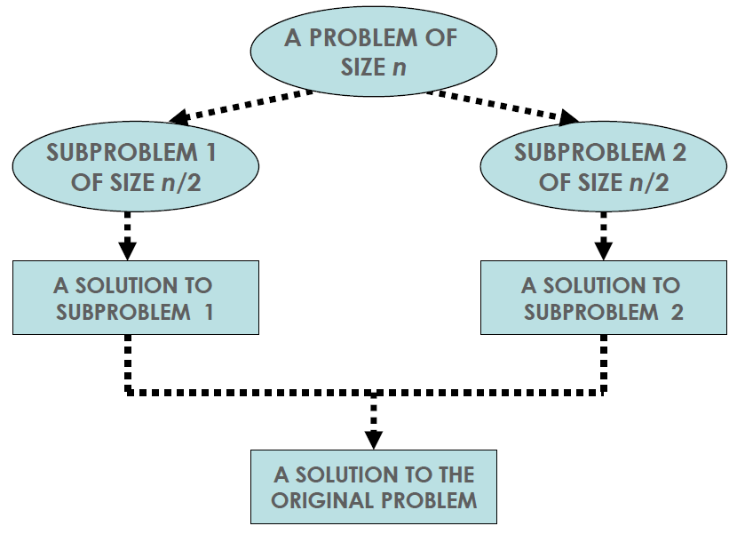
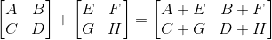
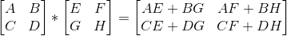
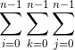
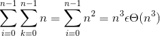

# Master Theorem
If we have a recurrence of this form:

T(n) = aT(n/b) + f(n) and f(n) ∈ Θ (n<sup>2</sup>) then:
* T(n) ∈ Θ(n<sup>d</sup>) if a < b<sup>d</sup>
* T(n) ∈ Θ(n<sup>d</sup>logn) if a = b<sup>d</sup>
* T(n) ∈ Θ(n<sup>log<sub>b</sub>a</sup>) if a > b<sup>d</sup>

Analogous results for O and Ω
* For this course we have to know how to apply the Master Theorem, not prove it or derive it

## Example
```python
int CountBits(int n):
    if(n==1):
        return 1
    else:
        return 1 + CountBits(n/2)
```
Recall that this is how we found the algorithmic efficiency before hand: 
* A(1) = 0 (Addition doesn't take place when n == 1)
* A(n) = A(n/2) + 1 for n > 1
* by letting n = 2<sup>2</sup> which is the same as saying k = log<sub>2</sub>n
* n/2 = 1/2 * 2<sup>2</sup> = 2<sup>-1</sup>*2<sup>k</sup> = 2<sup>2-1</sup>
* A(1) = A(2<sup>0</sup>) = 0
* A(n) = A(2<sup>2</sup>) = A(2<sup>k-1</sup>) + 1 for k > 0
* = [A(2<sup>k-2</sup>) + 1] + 1 = A(2<sup>k-2</sup>) + 2
* = A(2<sup>k-k</sup>)+k = A(2<sup>0</sup>) + k = k = log<sub>2</sub>n ∈ Θ (logn)

But with the master theorem we can see that 
* a = 1
* b = 2
* d = 0

Because if we put CountBits in the form of the master theorem i.e.: T(n) = aT(n/b) + f(n) it will look as follows:

* A(n) = A(n/2) + 1

Thus the values for a, b and d are as outlined above and by subbing them into the equation: a = b<sup>d</sup> then, with the master theorem we get the following:
* 1 = 2<sup>0</sup> 
* Which is equal

And if we look at the master theorem cases again:
* T(n) ∈ Θ(n<sup>d</sup>) if a < b<sup>d</sup>
* T(n) ∈ Θ(n<sup>d</sup>logn) if <u><b>a = b<sup>d</sup></b></u>
* T(n) ∈ Θ(n<sup>log<sub>b</sub>a</sup>) if a > b<sup>d</sup>

According to the second case, the recursive function will have the efficiency of T(n) ∈ Θ(n<sup>d</sup>logn). Thus, CountBits has the algorithmic efficiency of Θ (n<sup>0</sup>logn) i.e.: CountBits is **Θ (logn)**

# Divide & Conquer



## Matrix Addition


Which we can represent algorithmically as:
```java
for(int row = 0; row<n; row++){
    for(int col = 0; col < n; col++){
        C[row][col] = A[row][col] + B[row][col]
    }
}
```
Add matrix A to matrix B to get matrix C - Θ(n<sup>2</sup>)
## Matrix Multiplication


Algorithmically:
```java
for(int row = 0; row<n; row++){
    for(int j = 0; j< n;j++){
        for(int col = 0; col < n; col++){
            C[row][col] += A[row][j] + B[j][col]
        }
    }
}
```
There are n multiplication to calculate each of the n<sup>2</sup> values - Θ(n<sup>3</sup>)

How many multiplications:


Applying the rules we learned, we get:

