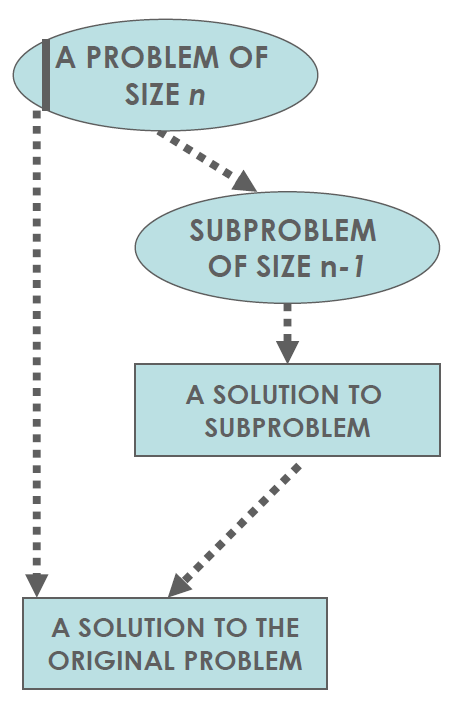
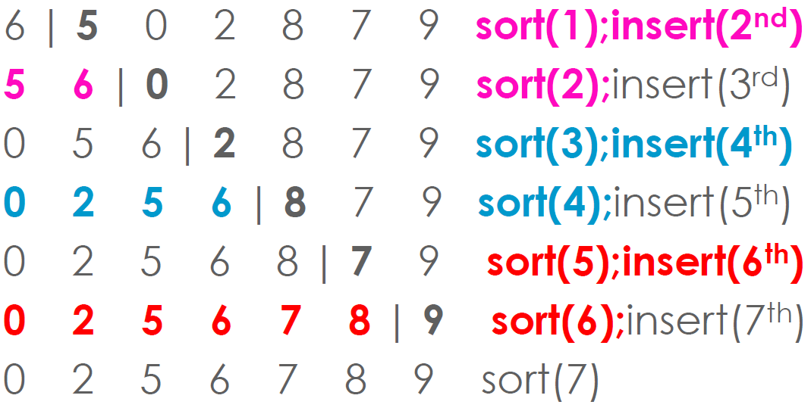
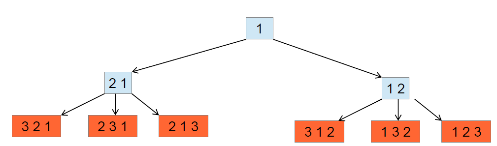
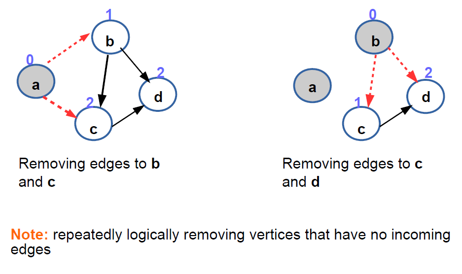

- [Decrease & Conquer](#decrease--conquer)
- [Decrease by a Constant Factor](#decrease-by-a-constant-factor)
- [Examples](#examples)
    - [Topological Sorting Algorithm](#topological-sorting-algorithm)
- [Multiplication a la Russe](#multiplication-a-la-russe)
- [Euclid's GCD](#euclids-gcd)
    - [Variable-Size Decrease](#variable-size-decrease)
- [Finding the k'th order statistic](#finding-the-kth-order-statistic)
- [Linear Interpolation Sort](#linear-interpolation-sort)
- [Strengths and Weaknesses of Decrease and Conquer](#strengths-and-weaknesses-of-decrease-and-conquer)
- [Transform and Conquer](#transform-and-conquer)

# Decrease & Conquer
* Decrease by a constant
* Decrease by a constant factor
* Variable size decrease

# Decrease by a Constant Factor
1. Reduce problem instance to smaller instance of the same problem and extend solution
2. Solve smaller instance
3. Extend solution of smaller instance to obtain solution to original problem
    *  Also called inductive or incremental



* Variable size decreases
# Examples
* Decrease by a constant (usually 1):
    * [Insertion sort](#insertion-sort)
    * Graph Searching: DFS, BFS
    * Generating permutations and subsets
    * [Topological sort](#topological-sorting-algorithm)
* Decrease by a constant factor (usually 2):
    * Binary Search
    * Fake-coin problem
    * Multiplication a la Russe
* Variable-size decrease:
    * Euclid's algorithm
    * Interpolation Search
    * Finding the k'th order statistic e.g.: the median
## Insertion Sort


## Generating Permutation
* input:
    * `{1,2,3}`
* output:
    * `123 132 213 231 312 321`
* Generate all n! orderings of {1,...,n}
    * Generate all (n-1)! permutations of {1, ... ,n-1}
    * Insert n into each possible position



* If insert starting from the right or left alternately, satisfies Minimal-Change requirement (next permutation obtained by swapping two elements of previous)
* Example:
    * Start: 1
    * Insert 2: 12, 21
    * Insert 3: 123, 132, 312, 321, 231, 213

### Johnson Trotter Method
* Avoids intermediate permutations that we don't need
* Use arrows to keep track of what permutation comes next
* An element k is mobile if its arrow points to an adjacent element smaller than it
```
→ ← → ←
3 2 4 1
```
3 & 4 are mobile. 1 & 2 not.

* Initialize the first permutation with:
```
← ←     ←
1 2 ... n
```
* While last permutation has mobile element:
    * Find its largest mobile element k
    * swap k with neighbour it points to
    * reverse direction of elements > k
    * add the new permutation to the lists
* return the list of permutations

Example: given 123, find all the permutation
||||
|---|---|---|
|←|←|←|
|1|2|3|
|←|←|←|
|1|3|2|
|←|←|←|
|3|1|2|
|→|←|←|
|3|2|1|
|←|→|←|
|2|3|1|
|←|←|→|
|2|1|3|

Thus, we can see that the Johnson Trotter method allows us to compute the permutations without the intermediate stats.

## Topological Sorting Algorithm


* Problem
    * Among n coins, one is fake (and weighs less)
    * We have a balance scale which can compare any two sets
* Algorithm
    * Divide into two size [n/2] piles (keeping a coin aside if n is odd)
    * If they weigh the same then the extra coin is fake
* Can we do better?
    * Decrease by factor of three

# Multiplication a la Russe
When someone invaded Russia they realized that the Russians did not multiply like they did, rather they used the following method:
* `n * m (n/2) * (2m)` <- even
* `((n-1)/2)*(2m)*m` <- odd

Using doubling and halving instead of multiplication is efficient in hardware as it is just shift operations.

# Euclid's GCD
Covered this problem initially in the [first lecture](TOA1.md), but it is a good example of Variable-Size Decrease.
## Variable-Size Decrease
* Problem
    * Greatest Common Divisor of two integers `m` and `n` is the largest integer that divides both exactly
* Euclid's Solution
    * `gcd(m,n) = gcd(n,m mod n)`
    * `gcd(m,0) = m`
    * Right-side args are smaller by neither a constant size nor a constant factor
* Example:
    * `gcd(60,24) = gcd(24,12) = gcd(12,0) = 12`
    * `gcd(24,60) = gcd(60,24) = gcd(24,12) = gcd(12,0) = 12`
    * This is a variable-size decrease as changing the `n` and `m` around 
# Finding the k'th order statistic
E.g.: Finding the median. Can use a decrease and 

# Linear Interpolation Sort
Variable Size Decrease, depends on the particular string you are looking for.
* Assume values between leftmost (A[b]) and rightmost (A[u]) elements increase linearly
* To find v
    * Binary Search with "Floating variables" at index i
    * Setup straight line through (b, A[b]) and (u,A[u])
    * Find point P = (x,y) on line at y = v, then i = x
    * x = b + ...

log(logn) efficiency <- Proof

# Strengths and Weaknesses of Decrease and Conquer

# Transform and Conquer 
This should probably be in the next summary
* Pre-sorting
    * Closest pair
    * Convex hull
    * 