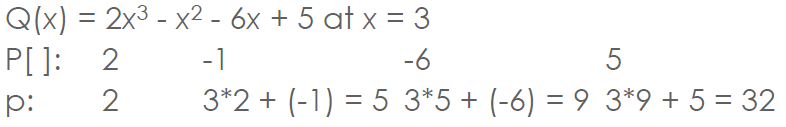
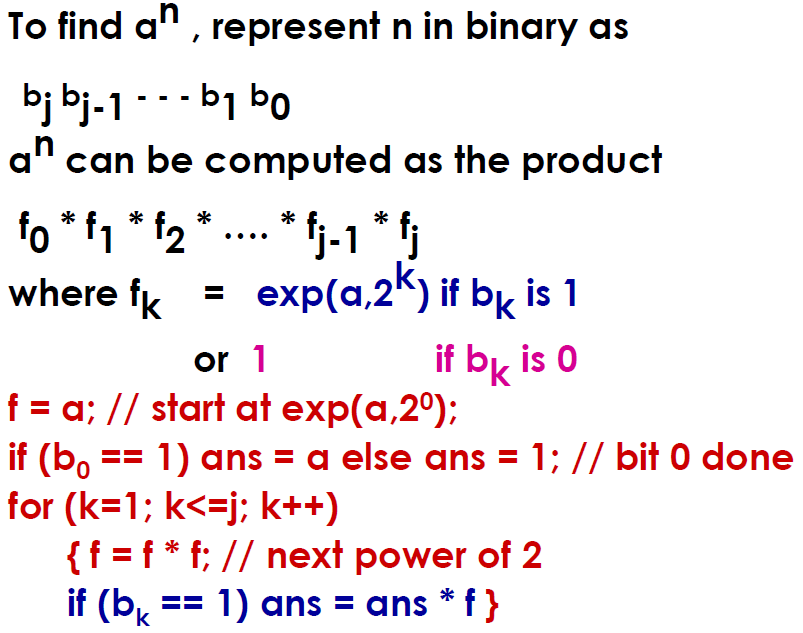
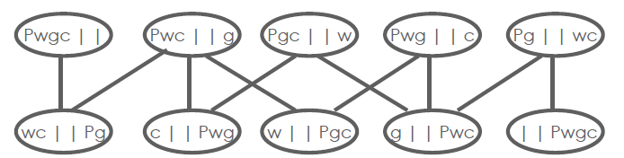

- [Transform and Conquer](#transform-and-conquer)
- [Instance Simplification](#instance-simplification)
    - [Presorting](#presorting)
- [Representation Change](#representation-change)
    - [Trees](#trees)
    - [Heapsort](#heapsort)
    - [Calculating Polynomials](#calculating-polynomials)
        - [Brute Force Polynomial](#brute-force-polynomial)
        - [Horner's Rule](#horners-rule)
    - [Binary Exponentiation](#binary-exponentiation)
- [Problem Reduction](#problem-reduction)
    - [Lowest Common Multiple](#lowest-common-multiple)
    - [Reduction to Graph Problems](#reduction-to-graph-problems)
- [Strengths and Weaknesses of Transform & Conquer](#strengths-and-weaknesses-of-transform--conquer)

# Transform and Conquer 
> The secret of life is to replace one worry with another

👆 Charles M. Schultz


Different types of transformations:
1. [Instance simplification](#instance-simplification) = a more convenient instance of the same problem
    * [Presorting](#presorting)
    * Gaussian elimination
2. [Representation Change](#representation-change) = a different representation of the same instance
    * [Balanced search trees](#trees)
    * [Heaps and heapsort](#heapsort)
    * [Polynomial evaluation by Horner's rule](#calculating-polynomials)
    * [Binary exponentiation](#binary-exponentiation)
3. [Problem reduction](#problem-reduction) = a different problem altogether
    * [Lowest Common Multiple](#lowest-common-multiple)
    * [Reduction to Graph Problems](#reduction-to-graph-problems)

# Instance Simplification
## Presorting
* Solve instance of problem by preprocessing the problem to transform it into another simpler/easier instance of the same problem
* Many problems involving lists are easier when list is sorted
    * Searching
    * Computing the median (selection problem)
    * Finding repeated elements
    * Convex hull & Closest Pair
* Efficiency
    * Introduce the overhead of an Θ(nlogn) preprocess
    * But the sorted problem often improves by at least one base efficiency class over the unsorted problem (e.g.: Θ(n<sup>2</sup>) -> Θ(n))

 **Example** sorting is Θ(nlogn) so transformation to sorting is only worthwhile if other algorithms are less efficient
 * Checking uniqueness
    * Brute force is Θ(n<sup>2</sup>) so sorting is more efficient
* Finding the mode
    * Brute force is Θ(n<sup>2</sup>) so sorting is more effective
* Searching an array
    * Brute force is Θ(n) so sorting is not better

**Example** Finding Repeated Elements
* Presorting algorithm for finding duplicated elements in a list
    * Use mergesort Θ(nlogn)
    * Scan to find repeated element: Θ(n)
* Brute force algorithm
    * Compare each element to every other: Θ(n<sup>2</sup>) 
* Conclusion: presorting yields **significant** improvement

**Example** Presorted selection
* Finding the k<sup>th</sup> smallest element in A[1], ..., A[n]
* Special cases
    * Min: k = 1
    * Max: k = n
    * Median: k = n/2
* Presorting-based algorithm
    * Sort list
    * return A[k]
* Partition-based algorithm (Variable Decrease & Conquer)

```
pivot/split A[s] usingPartitioning algorithm from Quicksort
if s == k:
    return A[s]
else if s< k:
    repeat with sublist A[s+1], ..., A[n]
else if s>k repeat with sublist A[1], ..., A[s-1]
```

IF we look at this algorithm:
* the presorting based one is Θ(nlogn) + Θ(1) = Θ(nlogn)
* The partitioning based algorithm (which is variable size decrease & conquer)
    * Worst case T(n) = T(n-1) + (n+1) ∈ Θ (n<sup>2</sup>)
    * Best case: Θ(n)
    * Average case: T(n) = T(n/2) + (n+1) ∈ Θ (n)
    * Also identifies the k smallest elements (not just the k<sup>th</sup>)
* Simpler linear (brute force) algorithm is better in the case of max & min
* Conclusion
    * Presorting does not help in this case

# Representation Change
## Trees
* Searching, insertion and deletion in a  Binary Search Tree:
    * Balanced = Θ(logn)
    * Unbalanced = Θ(n)
* Instance Simplification
    * AVL & Red-black trees constrain imbalances by restructuring trees using rotations
* Representation Change
    * B+ Trees attain perfect balance by allowing more than one element in a node

## Heapsort
* A heap is binary tree with conditions
    * It is essentially complete
    * The key at each node is >= keys at its children
    * The root has the largest key
    * The subtree rooted at any node of a heap is also a heap
* Heapsort algorithm
    1. Build heap
    2. Remove root - exchange with last (rightmost) leaf
    3. Fix up heap (excluding last leaf)
    4. Repeat 2,3 until heap contains just one node
* Efficiency
    * Θ(n) + Θ(nlogn) in both worst and average cases
    * Unlike mergesort it is in place
## Calculating Polynomials
Here is an example of a polynomial (p(x)), and the associated calculation for p(3)

p(x) = 2x<sup>4</sup> - x<sup>3</sup> + 3x<sup>2</sup> + x - 5
* Evaluate for x = 3

The traditional, obvious, brute force way:
p(3) = 2(3)<sup>4</sup> - (3)<sup>3</sup> + 3(3)<sup>2</sup> + (3) - 5
### Brute Force Polynomial
* For a polynomial of size n, just the first term a<sub>n</sub>x<sup>n</sup> requires n multiplications using brute force
* We can improve on this by efficiently calculating x<sup>n</sup>
* But Horner's rule does even better for large polynomials and it's dead easy

### Horner's Rule
Factor x out as much as possible - so using the same equation as above we can factor out x as follows:</p>
p(x) = 2x<sup>4</sup> - x<sup>3</sup> + 3x<sup>2</sup> + x - 5
= (2x<sup>3</sup> - x<sup>2</sup>+3x+ 1)x - 5
=((2x<sup>2</sup> - x + 3)x+1)x-5
=(((2x-1)x+3)x+1)x-5</p>
Here is another example:
p(x) = 2x<sup>3</sup> - x<sup>2</sup> - 6x + 5
     = (2x<sup>2</sup>-x-6)x + 5
     = ((2x-1)x-6)x+5

Find p(x) at x = 3
    2x<sup>3</sup>  -x<sup>2</sup>  -6x +5
c[]:2               -1              -6  +5
p:  2 2\*3+(-1)= 5 5\*3 + (-6) = 9 9\*3 + 5 = 32

```
double horner(coefficients[0 .. n],x){
    p = coefficients[n]
    for i = n-1 to 0:
        p = x\*p + coefficients[i]
    return p
}
```

* Horner's rule addresses the problem of evaluating a polynomial p(x) = a<sub>n</sub>x<sup>n</sup> + a<sub>n-1</sub>x<sup>n-1</sup> + ... + a<sub>1</sub> +a<sub>0</sub> at a given point x = x<sub>
0</sub>
* Re invested by W. Horner in early 19th Century
* Approach
    * Convert p(x)
* Algorithm

```
p=P[n]
for i <- n-1 downto 0:
    p <- x * p + P[i]
return p
```


The slides go into Horner's rule in a lot more depth [here](docs/HornersRule.pdf)

## Binary Exponentiation


# Problem Reduction
* If you need to solve a problem reduce it to another problem that you know how to solve
* Used in Complexity Theory to classify problems
* Computing the Least Common Multiple
    * The LCM of two positive integers m and n is the smallest integer divisible by both m and n
    * Problem reduction is to say LCM(m,n) = m * n / GCD(m,n)
    * Example: LCM(24,60) = 1440 / 12 = 120
* Reduction of Optimisation Problems
    * Maximization problems seek to find a function's maximum. Conversely, minimization seeks to find the minimum
    * Can reduce between: min f(x) = -max[-f(x)]
## Lowest Common Multiple
LCM(24,60) = ?
* 24 = 2 x 2 x 2 x 3
* 60 = 2 x 2 x 3 x 5
* LCM(24,60) = 2 x 2 x 3 x 2 x 5

Better?
* LCM(m,n) = (m*n)/GCD(m,n)

## Reduction to Graph Problems
* State-Space graphs
    * Vertices represent states and edges represent valid transitions between states
    * Start and goal vertices
    * Widely used in AI
* Example

River Crossing Puzzle [**P**easant, **W**olf, **G**oat, **C**abbage]



# Strengths and Weaknesses of Transform & Conquer
* Strengths
    * Allows powerful data structures to be applied
    * Effective in Complexity Theory
* Weaknesses
    * Can be difficult to derive (especially reduction)