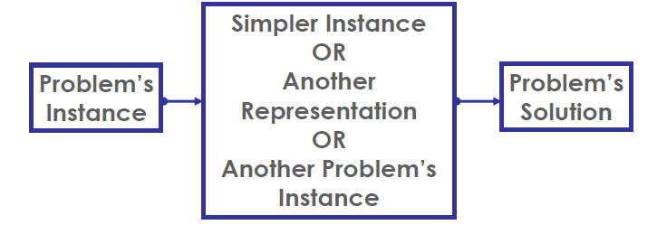

# Transform and Conquer 
> The secret of life is to replace one worry with another

👆 Charles M. Schultz

Different types of transformations:
1. Instance simplification = a more convenient instance of the same problem
    * Presorting
    * Gaussian elimination
2. Representation Change = a different representation of the same instance
    * Balanced search trees
    * Heaps and heapsort
    * Polynomial evaluation by Horner's rule
    * Binary exponentiation
3. Problem reduction = a different problem altogether
    * Lowest Common Multiple
    * Reductions to graph problem
* Pre-sorting
    * Closest pair
    * Convex hull

# Instance Simplication
## Presorting
* SOlve instance of problem by preprocessing the problem to transform it into anotehr simpler/easier instance of the same problem
* Many problems involving lists are easier when list is sorted
    * Searching
    * Computing the median (selection problem)
    * Finding repeated elements
    * Convex hull & Clsoest Pair
* Efficiency
    * Introduce the overhead of an Θ(nlogn) preprocess
    * But the sorted problem often improves by at least one base efficiency class over the unsorted problem (e.g.: Θ(n2) -> Θ(n))