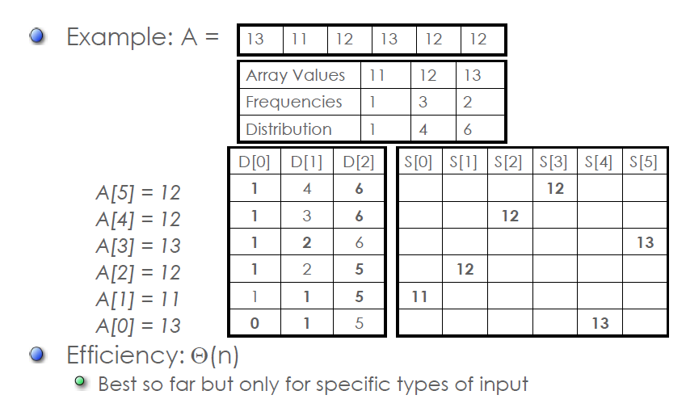
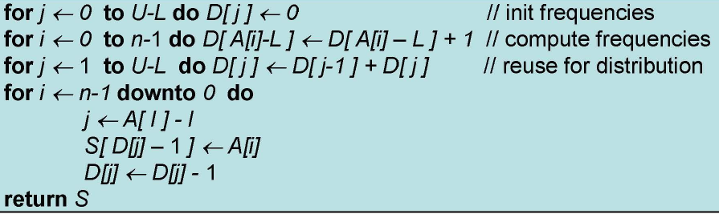
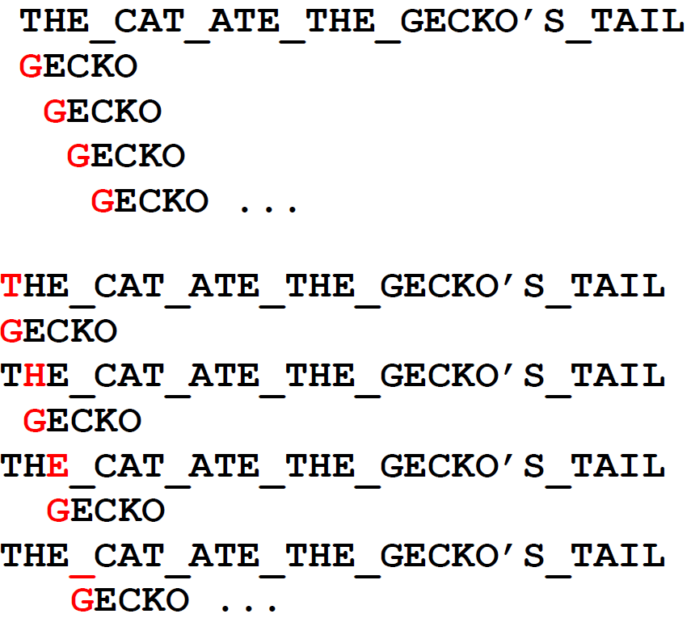
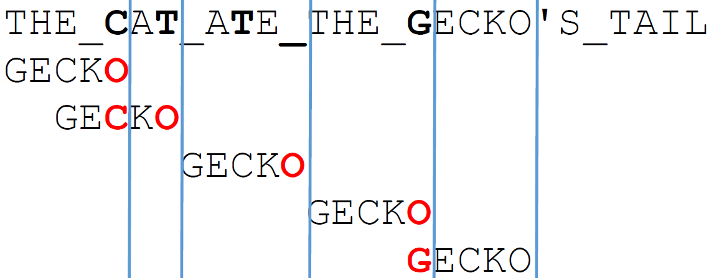

# Space Time
For many problems some extra space really pays off. Some examples of these are:
* Hashing
* B-Trees
* Sorting
* Horspool's and Boyer-Moore's Algorithm for String Matching
* Dynamic Programming
## Sorting by Counting


* Elements in [L.U]
* Constraint: we cannot overwrite the original list
* Distribution Counting
    * Compute the frequency of each element
* Algorithm


# String Searching
In the [third set of notes](TOA3.md) we covered string searching using Brute Force - which had an algorithmic efficiency of Θ(mn) where m is the text length and n is the pattern you are trying to match.

Here is a brief example of what brute force String searching looks like:


This algorithm will take 17 comparisons, but the Horspool algorithm only takes 5, shown below:



## Horspool's Algorithm
* Uses a *shift table T* with an entry per character c giving the number of places to shift the pattern when text character c is aligned with opposite character of the pattern.
```
If c is not in the first m-1 characters of the pattern
    then T(c) = m
    else T(c) distance from rightmost c to end of pattern
```
(m is the length of the pattern being searched for)

* Align the left-most character of the pattern to the left-most character of the text (as in brute force)
* Match pattern against corresponding text from right to left (i.e.: backwards through the pattern)
* If our pattern mismatches there are four cases to consider
* In all cases we compare the last letter of the pattern against the last corresponding letter in the text we are matching against
### Case 1
If the last letter is not in the pattern: (T is not in GECKO) -> Move the entire pattern past the last letter

(PATT stands for Pattern)
```
TEXT: A_CAT
PATT: GECKO
```
becomes
```
TEXT:A_CAT
PATT:     GECKO
```
### Case 2
If last letters match but that letter isn't in rest of pattern -> Move entire pattern past the last letter.
```
TEXT: HE_FOUND
PATT: GECKO
```
becomes
```
TEXT: HE_FOUND
PATT:      GECKO
```
Basically, the same as in case 1
### Case 3
If the last letter is in the pattern (C is in GECKO) -> Align with rightmost occurrence of that letter in pattern
```
TEXT: THE C...
PATT: CECKO
```
becomes
```
TEXT: THE C
PATT:   CECKO
```
### Case 4
If last letters match and that letter is elsewhere in the pattern -> Align with rightmost occurrence of that letter in the pattern
```
TEXT: ENDURING
PATT: ENGAGING 
```
becomes
```
TEXT: ENDURING
PATT:    ENGAGING
```
### On Mismatch
* If end letter isn't in the pattern, move right past it; otherwise align with rightmost occurrence of that letter in the pattern

### Summarized
1. Construct a shift table T
2. Align the pattern gainst the beginning of the text
3. Repeat until match or pattern reaches end text:
    * Starting with the last character of the pattern compare the corresponding characters in the text until either all m characters matched; or mismatch found.
    * On mismatch retrieve T(c) where c is character in text aligned to last character in pattern. Shift pattern right T(c) positions
### Example
Create the shift table for ENGAGING
|E|N|G|A|I|
|---|---|---|---|---|
|?|?|?|?|?|
The length `m = 8`. There are 5 unique letters:
```
T(E) = m - 1 - rightmost index of E = 8 - 1 - 0 = 7
T(N) = 8 - 1 - 6 = 1
T(I) = 8 - 1 - 5 = 2
T(G) = 8 - 1 - 4 = 3
T(A) = 8 - 1 - 3 = 4
```
It is better to start with the rightmost occurrence of a letter and work backwards
|E|N|G|A|I|
|---|---|---|---|---|
|7|1|3|4|2|

### Example 1
```
TEXT: IT.WAS.ENGAGING
PATT: ENGAGING
```
So as seen above, the mismatched letter was E.
T(E) = 7, so the shift pattern uses 7 places due to the shift table:

|E|N|G|A|I|
|---|---|---|---|---|
|7|1|3|4|2|

So then it will look as follows:
```
TEXT: IT.WAS.ENGAGING
PATT:        ENGAGING
```

Boom 🔥 How easy was that? 😎
### Example 2
```
TEXT: IT.WAS.VERY.ENGAGING
PATT: ENGAGING
```
The mismatched last letter = V. T(V) = 8 because it is a char that is not in the first 8-1 positions of the pattern. So Engaging is shifted up to `E` in `VERY`
```
TEXT: IT.WAS.VERY.ENGAGING
PATT:         ENGAGING
```
### Example 3
```
TEXT: IT.WAS.NOT.ENGAGING
PATT: ENGAGING
```
The mismatched letter = N T(N) = 1, so according to the shift table we only shift 1
|E|N|G|A|I|
|---|---|---|---|---|
|7|1|3|4|2|

```
TEXT: IT.WAS.NOT.ENGAGING
PATT:  ENGAGING
```
### Example 4
```
TEXT: IT.WAS.GOING.ENGAGINGLY
PATT: ENGAGING
```
Mismatched letter = G T(G) = 3 in the shift table, so we shift 3
|E|N|G|A|I|
|---|---|---|---|---|
|7|1|3|4|2|
```
TEXT: IT.WAS.GOING.ENGAGINGLY
PATT:    ENGAGING
```

## Boyer-Moore's
* Based on same two ideas
    * Compare pattern characters to text from right to left
    * Given a pattern, create a shift table that determines how much to shift the pattern
* Except
    * Uses an additional good-suffix table with same idea applied to the number of matched characters
* Efficiency
    * Horspool's approach is simpler and at least as efficient in the average case

**Prefix and Suffix**</p>
Prefix is whatever is at the beginning of the word. Suffix is whatever is at the end of the word.</p>
 **Consider** </p>
```
TEXT:       ???SER
Pattern:    BARBER
```
Horspool will do this:
```
???SER
   BARBER
```
As R is in the shift table for BARBER.

But since S is not in BARBER we can just shift the entire string past the S:
```
???SER
   BARBER
```
We know the letter where we fail, and that may be more important to us. Instead of looking at the last letter, we can look at the letter we are failing. Thus, in the example above, since S is not in BARBER we can just shift the entire string past the S:

### Bad Character Rule
* The rule for calculating this shift is called the bad character rule
* It needs a shift table calculated as in Horspool
* Instead of looking up the shift of the last char in the text that corresponds with the last char in the pattern, we look up the shift of the rightmost mismatched char

**Summary of Bad Character Shift**</p>
* Let m = length of string
* Let T = shift table as in Horspool
* Let k = number of matched chars from back
* Let c = mismatched char in text
    * Bad shift = max(T(c) - k, 1)

**Note** T(c) - k, could be less than 1, hence the max operation. We always cna shift at least 1 position, as in brute force

### Calculating Bad Character Shift
```
TEXT: TANSER
PATT: BARBER
```
becomes
```
TANSER
    BARBER
```
In this case we shift 4 positions, as opposed to Horspool's 3. This is because the number of matched chars from the back = 2. The pattern length = 6 and S is not in BARBER. So T(S) = 6.

If we let k = # of matched chars. Then:
```
Shift = T(S) - k
4     =   6  - 1
```
**Further Example**
```
TEXT: MY AEROPLANE
PATT: BARBER
```
Note A, the mismatched char is in BARBER. We are going to shift T(A) - k positions where T(A) = 6 - 1 - 1 = 4 as in horspool and k = the number of matched chars = 2 (as ER in a**er**oplane and barb**er** match)

So we are going to shift 4 - 2 = 2, leading to
```
TEXT: MY AEROPLANE
PATT:   BARBER
```
### Bad Char Shift v Horspool
```
TANSER
BARBER
```
using bad character rule shift we get
```
TANSER
    BARBER
```
using horspool we get
```
TANSER
   BARBER
```
The horspool algorithm is worse in this case because we are going to compare the R again. However, in the following example the horspool algorithm is better:
```
MY AEROPLANE
BARBER
```
Using bad char rule
```
MY AEROPLANE
  BARBER
```
Using horspool
```
MY AEROPLANE
   BARBER
```
### Good Suffix Rule
* This is the second shift rule calculated by Boyer Moore
* Boyer Moore selects whichever shift is greater of the good suffix versus bad character shift rule
### Preprocessing
* With Horspool and Boyer-Moore we are taking advantage of the fact that we know before we start searching everything about the pattern and nothing about the text
* The shift table is set up only using the information from the pattern
* Both algorithms try to extract useful information from the pattern in advance of the search, in order to maximise the size of the shift they do on each mismatch
* This is the point: the shift table is determined solely by the properties of the pattern, not the text
* It helps to understand this when we consider the next part of Boyer-Moore: Good Suffix Rule 

### Good Suffix Rule Cases
* Case 1: The matching suffix does not occur elsewhere in the pattern
* Case 2: The matching suffix does occur elsewhere in the pattern
* Case 3: A part of the matching suffix occurs at the beginning of the pattern (this happens only if the pattern has a suffix matching a prefix - e.g.: patterns like EMBLEM OR CHAOTIC OR POMPOM)

#### Example 1
Consider this text and pattern:
```
..ABAB...
MAOBAB
```
* k = 3 (the number of matched chars)
* Consider the suffix BAB, which is suff(3)
* Nowehere else in the pattern is there a BAB
* So we can shift the entire pattern
#### Example 1b
Consider this text and pattern
```
....ABAB...
OBABOBAB
```
* k = 3
* Here bab does occur previously in the pattern, but - it is preceded by the same mismatched letter, o.
* So there can't possibly be a match and we can shift the entire pattern

#### Example 2
Consider this text and pattern
```
....ABAB...
ABABCBAB
```
* Here the suffix does recur, with a letter not equal to C, i.e.: A.
* We should shift the pattern as follows:
```
....ABAB....
....ABABCBAB
```
#### Example 2b
```
....ABAB...
ZBABCBAB
```
* The good suffix rule is not able to determine that the Z and the A do not match, and that we could have shifted the entire string. Thus, it will look as follows
```
....ABAB....
    ZBABCBAB
```
#### Example 3
Consider this text and pattern
```
.....ABAB...
   ABCBAB
```
* Here the front letters match part of the suffix
* So where we shift 4
* This problem only occurs for a prefix of the pattern matching a suffix of the pattern
```
.....ABAB...
       ABCBAB
```

### Good Shift Table Construction
* k = # of matched chars from end of pattern
* **Bold** is the part of the pattern matched
* <u>underlined</u> the right most match to suffix
* good_shift = distance to beginning of closest match

|k|Pattern|good_shift|
|---|---|---|
|1|ABC<u>B</u>A**B**|2|
|2|<u>AB</u>CB**AB**|4|
|3|<u>AB</u>C**BAB**|4|
|4|<u>AB</u>**CBAB**|4|
|5|<u>A**B</u>CBAB**|4|

* Length of pattern = m
1. For each suffix of length k 
    * Find starting index, j, of rightmost match to suffix that doesn't have the same preceding char
    * If one is found, set good_shift entry G(k) = m-k-j
2. For each suffix of length k not yet set
    * Find longest prefix of size n that matches the suffix
    * If one is found, set good_shift entry G(k) = distance between this matching prefix and suffix
3. For each suffix of length k not yet set
    * Set good_shift entry G(k) = m

### Summary
* Good-suffix shift:
    * If k symbols matched before failing, shift the pattern up G(k) positions
* Bad-symbol shift
    * If k symbols matched before failing, shift the pattern up T(c) - k positions (where c is the character that didn't match)
    * Actually shift = max(T(c)-k,1)
* Algorithm:
    1. Build tables T and G
    2. When searching, use either bad-symbol shift or good-suffix shift, whichever is larger

### Algorithm
```
1. Construct the bad character shift table
2. Construct the good suffix shift table
3. Align the pattern at start of text
4. Repeat until match or end of text reached
    Starting with the last character of the pattern compare corresponding characters in the text until either all m characters matched or there is a mismatch
    in case of mismatch:
        if k (number of matched chars) = 0
            Shift using the bad char table
        Else (k>0)
            Shift using the larger of the good suffix and bad char tables
```
### Example Good-Suffix Tables
Pattern BIGWIG

|1|2|3|4|5|
|---|---|---|---|---|
|3|3|6|6|6|

Pattern BAOBAB
|1|2|3|4|5|
|---|---|---|---|---|
|2|5|5|5|5|

### Examples
Find BAOBAB in: `BESS KNEW ABOUT BAOBABS`
* Bad Symbol Shift Table:

|A|B|...|O|...|
|---|---|---|---|---|
|1|2|6|3|6|

* Good Suffix Shift Table:

|1|2|3|4|5|
|---|---|---|---|---|
|2|5|5|5|5|

Find ZIGZAG in: `A ZIG, A ZAG, AGAIN A ZIGZAG`
* Bad-Symbol Shift Table

|A|...|G|...|I|...|Z|
|---|---|---|---|---|---|--|
|1|6|3|6|4|6|2|

* Good Suffix Shift Table

|1|2|3|4|5|
|---|---|---|---|---|
|3|6|6|6|6|

# Time & Space
* Horspool and Boyer Moore use additional space (the tables) to get a gain in speed
* Also Horspool and Boyer Moore do preprocessing, which takes time. This is traded off with the reduced number of comparisons they have to make compared to brute-force.

Cool way to test this yourself:
* Download War & Peace from Guttenberg
* Use a script to generate dozens of search strings of 4 to 6 chars each
* Implement brute force and horspool
* Both algorithms search for every occurrence of every pattern in War & Peace
* Check your results, an implementation by Sonia Berman had the following results:
    * Brute Force: 30 Seconds, 3.6 Billion Comparisons
    * Horspool: 23 Seconds, 1.1 Billion Comparisons
* It isn't rigorous, but interesting.