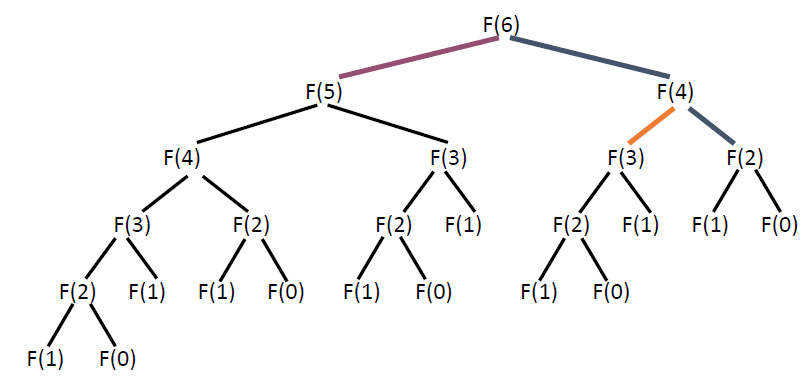
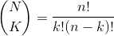
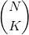
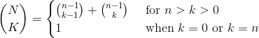
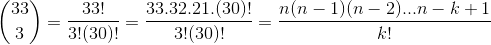
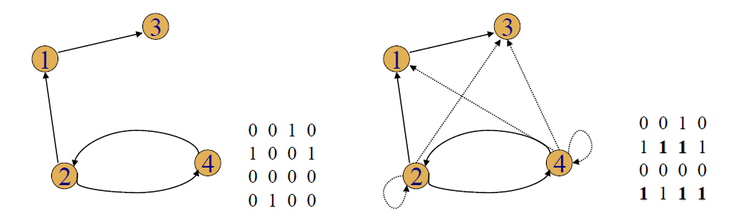
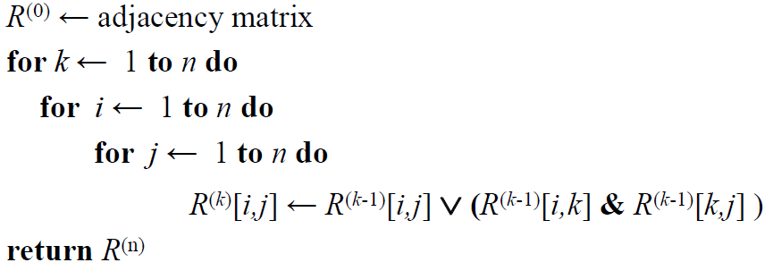
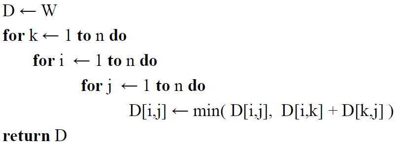

# Dynamic Programming
* Dynamic Programming is a general algorithm design technique.
* Invented to solve optimization problems in 1950s by American mathematician Richard Bellman
* "Programming" <=> "Planning"
## Key Features
* Construct table of all subproblem results
    * Initialized entries of smallest subproblem
    * Remainder filled in following a precise order
        * Corresponding to increasing subproblem size
        * Use only entries that have already been computed
* Each entry is calculated exactly once
* Final value computed is solution to the initial problem
* Use iteration (and extra space for saved results)
* avoid recursion if possible
## Principle of Optimality
> An optimal solution to an instance of an optimization problem is composed of optimal solution to its subinstances
## Memory Function
* Dynamic Programming: problems whose solution satisfy a recurrence relation with overlapping subproblems
* Top-down solves common subproblems more than once -> very inefficient - exponential!
* Dynamic Programming fills table with all subproblems but calculates each one only once
    * Top-down does not solve unnecessary subproblems
* Combine both - use memory function
* Fill table with nulls to indicate value not calculated and then proceed top down
## Summary
* Dynamic Programing is typically applied to a recurrence relation
* Break a problem down into smaller, more easily solved subproblems. To avoid solving these subproblems several times, their results are computed and recorded in a table
* Dynamic Programming can only be applied with the principle of optimality holds: the optimal solutions of subproblems can lead to the optimal solution of the overall problem
* Biggest limitation of Dynamic Programming is the number of partial solutions we must keep track of
    * If the objects are not ordered we have an exponential number of possible partial solutions
    * Dynamic Programming is effective on well-ordered problems
* The memory function tries to combine the strengths of top-down and bottom-up by doing only those subproblems that are needed and only doing them once

## Greedy Algorithms
* Repeatedly tries to maximize the return based on examining local conditions, with the hope that the outcome will lead to a desired outcome for the global problem
    * In some cases such a strategy is guaranteed to offer optimal solutions in some other cases it may provide a compromise that produces acceptable approximations
* Optimization problems are solved through a sequence of choices that are:
    1. Feasible - satisfy problem constraints
    2. Locally optimal - best choice among all feasible options for that step
    3. Irrevocable - no backing out
* Greedy grab of the best alternative, hoping that a sequence of locally optimal steps will lead to a globally optimal solution
* Even if not optimal, sometimes an approximation is acceptable
* Not all optimization problems can be approached in this manner
* Strengths
    * Intuitively simple and appealing
* Weaknesses
    * Only applicable to optimization problems
    * Doesn't always produce an optimal solution

# Examples
## Fibonacci Numbers
Fibonacci Recursive function can be written as *F(n) = F(n-1)+F(n-2)*, and if we complete it wth F(6) it will look as follows:



But Fibonacci with Dynamic Programming looks as follows:
```
A[0] =a;
A[1] = 1;
for k = 2 to n do:
    a[k] <- A[k-1] + A[k-2]
return A[n]
```
This saves so much computation time, as you are no longer working out every single iteration of the fibonacci sequence, but rather simply summing the last two terms.
## Binomial Coefficient
The coefficient of the x<sup>k</sup> term in the polynomial expansion of the binomial power (1+x)<sup>n</sup>

 for `n ≥ k ≥ 0`

 if `k < 0` or `k > n`

 

By substituting the values 33 and 3 into the above equation it would look as follow, and have the resultant general form:



## Optimal Static Binary Search Tree
* Static
    * Only search operations
    * No insertions or deletions
* Optimal
    * Minimizes the expected search time for a given probability distribution
* Straight forward approach
    * Construct all possible binary trees containing all n keys
    * Compute the average number of comparisons in each tree
    * Select the tree with the minimum number of comparisons
## Transitive Closure: Warshall's Algorithm
* Adjacency Matrix
    * The adjacency of a graph with n vertices is an n-by-n Boolean matrix with a row and a column for each of the graphs vertices, where the element in the ith row and jth column is 1 is there is an edge from the ith vertex to the jth vertex and a 0 if there is no edge
* Transitive Closure
    * A directed graph with n vertices is the n-by-n boolean matrix where element in the ith row and jth column is 1 if there is a directed path from the ith vertex to the jth vertex
* Warshall's
    * Computes the transitive closure of a relation
    * or all paths in a directed graph



Here is the algorithm:


## All Pairs Shortest Path: Floyd's Algorithm
* Tabulate distances between pairs of points on the map, roughly the same idea as Warshall's algorithm
* In a  weighted graph, find shortest paths between every pair of vertices
* Construct solution through series of matrices D(0), D(1).. using an initial subset of vertices as intermediaries



## Knapsack Problem

## Knapsack Memory Function Solution

## Change Making
* Greedy algorithm

## Text Compression
* Huffman Coding - Greedy algorithm