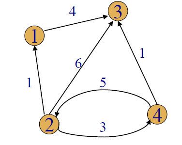

# Dynamic Programming
* Dynamic Programming is a general algorithm design technique.
* Invented to solve optimization problems in 1950s by American mathematician Richard Bellman
* "Programming" <=> "Planning"
## Key Features
* Construct table of all subproblem results
    * Initialized entries of smallest subproblem
    * Remainder filled in following a precise order
        * Corresponding to increasing subproblem size
        * Use only entries that have already been computed
* Each entry is calculated exactly once
* Final value computed is solution to the initial problem
* Use iteration (and extra space for saved results)
* avoid recursion if possible
## Principle of Optimality
> An optimal solution to an instance of an optimization problem is composed of optimal solution to its subinstances
## Memory Function
* Dynamic Programming: problems whose solution satisfy a recurrence relation with overlapping subproblems
* Top-down solves common subproblems more than once -> very inefficient - exponential!
* Dynamic Programming fills table with all subproblems but calculates each one only once
    * Top-down does not solve unnecessary subproblems
* Combine both - use memory function
* Fill table with nulls to indicate value not calculated and then proceed top down

## Top Down v Button Up
* Top-down approach: This is the direct fall-out of the recursive formulation of any problem. If the solution to any problem can be formulated recursively using the solution to its sub-problems, and if its sub-problems are overlapping, then one can easily memoize or store the solutions to the sub-problems in a table. Whenever we attempt to solve a new sub-problem, we first check the table to see if it is already solved. If a solution has been recorded, we can use it directly, otherwise we solve the sub-problem and add its solution to the table.
* Bottom-up approach: Once we formulate the solution to a problem recursively as in terms of its sub-problems, we can try reformulating the problem in a bottom-up fashion: try solving the sub-problems first and use their solutions to build-on and arrive at solutions to bigger sub-problems. This is also usually done in a tabular form by iteratively generating solutions to bigger and bigger sub-problems by using the solutions to small sub-problems. For example, if we already know the values of F41 and F40, we can directly calculate the value of F42.
## Summary
* Dynamic Programing is typically applied to a recurrence relation
* Break a problem down into smaller, more easily solved subproblems. To avoid solving these subproblems several times, their results are computed and recorded in a table
* Dynamic Programming can only be applied with the principle of optimality holds: the optimal solutions of subproblems can lead to the optimal solution of the overall problem
* Biggest limitation of Dynamic Programming is the number of partial solutions we must keep track of
    * If the objects are not ordered we have an exponential number of possible partial solutions
    * Dynamic Programming is effective on well-ordered problems
* The memory function tries to combine the strengths of top-down and bottom-up by doing only those subproblems that are needed and only doing them once

## Greedy Algorithms
* Repeatedly tries to maximize the return based on examining local conditions, with the hope that the outcome will lead to a desired outcome for the global problem
    * In some cases such a strategy is guaranteed to offer optimal solutions in some other cases it may provide a compromise that produces acceptable approximations
* Optimization problems are solved through a sequence of choices that are:
    1. Feasible - satisfy problem constraints
    2. Locally optimal - best choice among all feasible options for that step
    3. Irrevocable - no backing out
* Greedy grab of the best alternative, hoping that a sequence of locally optimal steps will lead to a globally optimal solution
* Even if not optimal, sometimes an approximation is acceptable
* Not all optimization problems can be approached in this manner
* Strengths
    * Intuitively simple and appealing
* Weaknesses
    * Only applicable to optimization problems
    * Doesn't always produce an optimal solution

# Examples
## Fibonacci Numbers
Fibonacci Recursive function can be written as *F(n) = F(n-1)+F(n-2)*, and if we complete it wth F(6) it will look as follows:


But Fibonacci with Dynamic Programming looks as follows:
```
A[0] =a;
A[1] = 1;
for k = 2 to n do:
    a[k] <- A[k-1] + A[k-2]
return A[n]
```
This saves so much computation time, as you are no longer working out every single iteration of the fibonacci sequence, but rather simply summing the last two terms.
## Binomial Coefficient
The coefficient of the x<sup>k</sup> term in the polynomial expansion of the binomial power (1+x)<sup>n</sup>

 for `n ≥ k ≥ 0`

 if `k < 0` or `k > n`

 

By substituting the values 33 and 3 into the above equation it would look as follow, and have the resultant general form:


Write a function that takes two parameters `n` and `k` and returns the value of the binomial coefficient C(n,k). E.g.: given n = 4, and k = 2, the function should return 6 as
4!/(2!(4-2)!) = 6

Programmatically, the value of C(n,k) can be recursively calculated using the following standard formula for Binomial Coefficients:
* C(n,k) = C(n-1,k-1) + C(n-1,k)

This will stop once we reach the base condition:
* C(n,0) = C(n,n) = 1

In code this looks as follows:
```java
int binomialCoeff(int n, int k){
    if(k == 0 || k == n){
        return 1;
    }
    return binomialCoeff(n-1,k-1) + binomialCoeff(n-1,k);
}
```
There are numerous overlapping subproblems, thus we should use Dynamic Programming.

```java
int binomialCoeff(int n, int k){
    int[][] values = new int[n+1][k+1];
    for(int i = 0; i<n+1; i++){
        for(int j = 0; j<=Math.min(i,k);j++){
            if(j==0 || j== i){
                values[i][j] = 1;
            }else{
                values[i][j] = values[i-1][j-1] + values[i-1][j];
            }
        }
    }
    return values[n][k];
}
```

You can compare the two different implementations in the [example file](examples/java/BinomialCoefficient)
## Optimal Static Binary Search Tree
* Static
    * Only search operations
    * No insertions or deletions
* Optimal
    * Minimizes the expected search time for a given probability distribution
* Straight forward approach
    * Construct all possible binary trees containing all n keys
    * Compute the average number of comparisons in each tree
    * Select the tree with the minimum number of comparisons
* Need to construct optimal BST - likely things near top, unlikely things near bottom
* Bruteforce method would be to construct all possible trees, but with DP we can follow a better method:
    * Have probabilities attached to each node
    * Construct all n-1 key trees before can construct n key tree
## Transitive Closure: Warshall's Algorithm
* Adjacency Matrix
    * The adjacency of a graph with n vertices is an n-by-n Boolean matrix with a row and a column for each of the graphs vertices, where the element in the ith row and jth column is 1 is there is an edge from the ith vertex to the jth vertex and a 0 if there is no edge
* Transitive Closure
    * A directed graph with n vertices is the n-by-n boolean matrix where element in the ith row and jth column is 1 if there is a directed path from the ith vertex to the jth vertex
* Warshall's
    * Computes the transitive closure of a relation
    * or all paths in a directed graph


Here is the algorithm:


## All Pairs Shortest Path: Floyd's Algorithm
* Tabulate distances between pairs of points on the map, roughly the same idea as Warshall's algorithm
* In a  weighted graph, find shortest paths between every pair of vertices
* Construct solution through series of matrices D(0), D(1).. using an initial subset of vertices as intermediaries
* Finds shortest/cheapest path between every pair of vertices in a weighted directed graph




Algorithm


## Warshall vs Floyd
* Warshall tells us if path exists or not (1 or 0 in the table)
* Floyd tells us the values of shortest costs/paths (infinity or integer)


## Knapsack Problem
We have a knapsack with capacity W, and a set of items S. Each item has a weight wi and value vi. We must maximise the value in the bag while minimising the weight

This can be done as follows: max(taking element N, not taking element N)

```
knapsack(i,j):
    if(V[i,j]<0)
        if j < weights[i]:
            value = knapsack(i-1,j)
        else:
             value = max(knapsack(i-1),j),values[i]+knapsack(i-1,j-weights[i])
        v[i,j] = value
return V[i,j]
```
## Knapsack Memory Function Solution

## Change Making
Problem: give change for a specific amount n, with the least number of coins of the denominations. d1, d2 ... dm
* Greedy algorithm
* Each step choose the biggest coin which is smaller than the remaining total, repeat
* Optimal efficiency for reasonable sets of coins, but if there are unusual denominations the algorithm can fail
## Text Compression
* Text Compression
    * Variable-length encoding
        * Compress text by mapping each character to a code
        * The length of a code depends on the probability of its character occurring
    * Prefix-free code system
        * There is no code in the system which is a prefix (substring from first character) of any other code in the system
        * Unambiguous
* Huffman Coding - Greedy algorithm
    * Uses both variable length and prefix free
    * Builds a huffman tree that assigns shorter strings to higher frequency characters