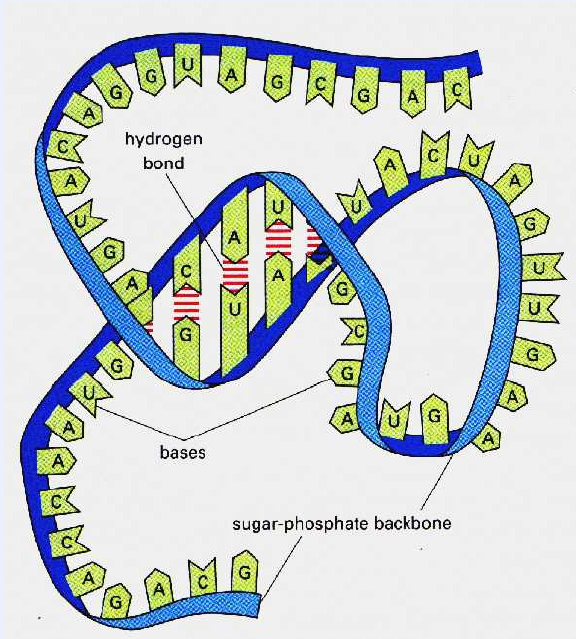

# Theory of Computation
# Module Outline
* We are going to build Computational models
    * Simplest one is a **finite automaton** (FA) -> Finite State Machine (FSM)
    * Second one is a **pushdown automaton** (PDA) 
    * Third one is a **Turing Machine** (TM)
* We are going to analyse these models
    * Define the languages they accept
    * Determine their limits
    * We'll see that TMs are stronger than PDAs, which are stronger than FAs
    * In fact, it turns out that TMs provide the limits of computation
    * To do all of this, we need to be precise and formal about everything.
# Computers vs Computing
* Variants of pushdown automata are used in modelling the structure of RNA

# Discrete Mathematics
* A set S is a well-defined collection of mathematical objects: {x1,x2,...,xn}. Sets can be finite or infinite.
* Members of a set are called elements - x ϵ S or X ∉ S.
* S and T are equal (S = T) if and only if they contain exactly the same elements
* Elements cannot have multiple instances in a set. Order does not play any role in a set. So `{1,1,2} = {1,2} = {2,1}`
* Explicit definition of a set: `{1,2,a,x,b,{1,c}}`
* Implicit definition: `{x|x is an even integer},{x|x is a natural member, x>= 5 and x < 9} = {5,6,7,8}`
* Multisets: can have multiple instances: so `{3,5,3}` is different from `{5,3}`
## Subsets
* T is a subset of S (T ⊆ S) if and only if the following holds: if x ϵ T then x ϵ S
* T is a strict subset of S (T ⊂ S) if and only if the following holds: T ⊆ S but S ...
## Set Operators
* Union: S ∪ T = {x | x ϵ S or x ϵ T}
* Intersection: S ∩ T = {x | x ϵ S and x ϵ T}
* Set difference: S \ T = {x |x ϵ S or x ! T}...
## Power sets and products
